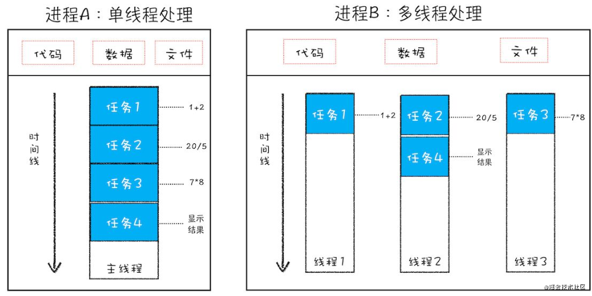

<!--
 * @Author: Li Zhiliang
 * @Date: 2020-11-18 11:14:03
 * @LastEditors: Li Zhiliang
 * @LastEditTime: 2020-11-27 11:45:51
 * @FilePath: /FE-Interview.git/browser/knowledge.md
-->
# Knowledge

## 1. HTTP和TCP的不同

HTTP的责任是去定义数据，在两台计算机相互传递信息时，HTTP规定了每段数据以什么形式表达才是能够被另外一台计算机理解。

而TCP所要规定的是数据应该怎么传输才能稳定且高效的传递与计算机之间。

## 2. TCP和UDP的区别

- TCP是一个面向连接的、可靠的、基于字节流的传输层协议。

- UDP是一个面向无连接的传输层协议。

TCP为什么可靠，是因为它有三次握手来保证双方都有接受和发送数据的能力。

字节流服务：将大块数据分割为以报文段为单位的数据包进行管理

## 3. 进程和线程

多线程可以并行处理任务，但是线程不能单独存在，必须由进程来启动来管理。就是说进程是爸爸，线程是儿子，一个爸爸可以有很多个儿子。下面是关于线程的一张图，外面的框框就是一个进程，里面的就是线程。



一个进程就是一个程序的运行实例，启动一个程序的时候，操作系统为该程序创建一块内存，用来存放代码和运行中的数据和一个执行任务的主线程，这就是进程。

特点：

- 进程中任一线程出错，都会导致整个进程崩溃

- 线程之间可以共享进程中的数据

- 一个进程关闭后，操作系统会回收进程占用的内存

- 进程之间的内容相互隔离

### 目前谷歌浏览器的多进程架构

最新的谷歌浏览器包括了：**1个浏览器（Browser）主进程，1个GPU进程，一个网络（NetWork）进程，多个渲染进程和多个插件进程。**

- 浏览器进程：负责页面显示、用户交互、子进程管理、提供存储等功能

- 渲染进程：核心任务是将HTML、CSS和Js转换为可以与用户交互的网页，排版进程Blink和Js的V8引擎运行在该进程中，默认情况下，Chrome会为每一个新开标签创建一个新的渲染进程（还会受同一站点的影响，下一题解释），每一个渲染进程运行在安全沙箱下，

- GPU进程：实现3D CSS效果，绘制网页的UI界面

- 网络进程：负责页面的网络资源加载

- 插件进程：负责插件的运行，每一个插件对应一个线程。单独开一个线程主要是为了防止插件崩溃而对网页造成影响


## 4. 垃圾怎么进行回收的

内存空间分为栈和堆。栈中的数据是每当执行完一个函数的实行上下文时就会销毁，例如showName这个函数

```js
showName() {
    let name = '王大锤'
    console.log(name)
}
```

执行这个函数的时候，js引擎会创建它的执行上下文，压入调用栈中。当执行完这个函数就会出栈，最后内存就销毁了。

而销毁堆中的内存就需要垃圾回收器来帮助了，我们来看另一个函数

```js
function bar() {
    let obj = {name: '王大锤'}  //obj是指向堆中保存这个对象的内存的引用
}
```

执行bar函数的时候它的执行上下文会入栈，而函数里创建了一个对象，此时变量obj是一个引用类型变量，它指向堆中的一个内存地址，而堆中这个内存地址存放着{name: '王大锤'}这个数据。当bar函数执行上下文出栈的时候就销毁了obj变量，但是对象obj是指向堆内存中的一块地址引用，仍然在堆中存在没有被销毁。我们再看看V8引擎是如何销毁堆中的垃圾数据的。


## 3.
## 3.
## 3.
## 3.
## 3.
## 3.
## 3.