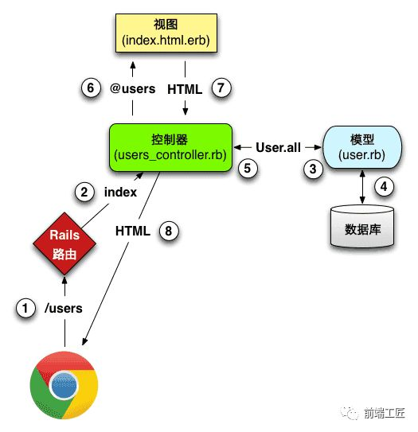

<!--
 * @Author: Li Zhiliang
 * @Date: 2020-11-18 14:32:50
 * @LastEditors: Li Zhiliang
 * @LastEditTime: 2020-11-19 09:28:55
 * @FilePath: /FE-Interview.git/browser/urlPageShow.md
-->
# 输入 URL 到页面展现的过程

## 从URL输入到页面展现到底发生什么？

打开浏览器从输入网址到网页呈现在大家面前，背后到底发生了什么？经历怎么样的一个过程？先给大家来张总体流程图


- DNS 解析:将域名解析成 IP 地址

- TCP 连接：TCP 三次握手

- 发送 HTTP 请求

- 服务器处理请求并返回 HTTP 报文

- 浏览器解析渲染页面

- 断开连接：TCP 四次挥手

### 一、URL 到底是啥

URL（Uniform Resource Locator），统一资源定位符，用于定位互联网上资源，俗称网址。比如 http://www.w3school.com.cn/html/index.asp，遵守以下的语法规则：

**scheme://host.domain:port/path/filename**各部分解释如下：

- scheme - 定义因特网服务的类型。常见的协议有 http、https、ftp、file，其中最常见的类型是 http，而 https 则是进行加密的网络传输。

- host - 定义域主机（http 的默认主机是 www） 

- domain - 定义因特网域名，比如 w3school.com.cn 

- port - 定义主机上的端口号（http 的默认端口号是 80） 

- path - 定义服务器上的路径（如果省略，则文档必须位于网站的根目录中）。

- filename - 定义文档/资源的名称

### 二、域名解析（DNS）

在浏览器输入网址后，首先要经过域名解析，因为浏览器并不能直接通过域名找到对应的服务器，而是要通过 IP 地址。

#### 1.IP 地址

IP 地址是指互联网协议地址，是 IP Address 的缩写。IP 地址是 IP 协议提供的一种统一的地址格式，它为互联网上的每一个网络和每一台主机分配一个逻辑地址，以此来屏蔽物理地址的差异。IP 地址是一个 32 位的二进制数，比如 127.0.0.1 为本机 IP。

**域名就相当于 IP 地址乔装打扮的伪装者，带着一副面具。它的作用就是便于记忆和沟通的一组服务器的地址。**

用户通常使用主机名或域名来访问对方的计算机，而不是直接通过 IP 地址访问。

因为与 IP 地址的一组纯数字相比，用字母配合数字的表示形式来指定计算机名更符合人类的记忆习惯。但要让计算机去理解名称，相对而言就变得困难了。因为计算机更擅长处理一长串数字。为了解决上述的问题，DNS 服务应运而生。

#### 2.什么是域名解析

DNS 协议提供通过域名查找 IP 地址，或逆向从 IP 地址反查域名的服务。**DNS 是一个网络服务器，我们的域名解析简单来说就是在 DNS 上记录一条信息记录。**

```js
例如 baidu.com  220.114.23.56（服务器外网IP地址）80（服务器端口号）
```

#### 3. 浏览器如何通过域名去查询 URL 对应的 IP 呢

- 浏览器缓存：浏览器会按照一定的频率缓存 DNS 记录。

- 操作系统缓存：如果浏览器缓存中找不到需要的 DNS 记录，那就去操作系统中找。

- 路由缓存：路由器也有 DNS 缓存。

- ISP 的 DNS 服务器：ISP 是互联网服务提供商(Internet Service Provider)的简称，ISP 有专门的 DNS 服务器应对 DNS 查询请求。

- 根服务器：ISP 的 DNS 服务器还找不到的话，它就会向根服务器发出请求，进行递归查询（DNS 服务器先问根域名服务器.com 域名

- 服务器的 IP 地址，然后再问.baidu 域名服务器，依次类推）


#### 4. 小结

浏览器通过向 DNS 服务器发送域名，DNS 服务器查询到与域名相对应的 IP 地址，然后返回给浏览器，浏览器再将 IP 地址打在协议上，同时请求参数也会在协议搭载，然后一并发送给对应的服务器。接下来介绍向服务器发送 HTTP 请求阶段，HTTP 请求分为三个部分：TCP 三次握手、http 请求响应信息、关闭 TCP 连接。


### 三、TCP 三次握手

在客户端发送数据之前会发起 TCP 三次握手用以同步客户端和服务端的序列号和确认号，并交换 TCP 窗口大小信息。


#### 1.TCP 三次握手的过程如下：

- **客户端发送一个带 SYN=1，Seq=X 的数据包到服务器端口**（第一次握手，由浏览器发起，告诉服务器我要发送请求了）

- **服务器发回一个带 SYN=1， ACK=X+1， Seq=Y 的响应包以示传达确认信息**（第二次握手，由服务器发起，告诉浏览器我准备接受了，你赶紧发送吧）

- **客户端再回传一个带 ACK=Y+1， Seq=Z 的数据包，代表“握手结束”**（第三次握手，由浏览器发送，告诉服务器，我马上就发了，准备接受吧）

#### 2.为啥需要三次握手

为了防止已失效的连接请求报文段突然又传送到了服务端，因而产生错误”。

### 四、发送 HTTP 请求

TCP 三次握手结束后，开始发送 HTTP 请求报文。请求报文由请求行（request line）、请求头（header）、请求体四个部分组成,如下图所示:


#### 1.请求行包含请求方法、URL、协议版本

- 请求方法包含 8 种：GET、POST、PUT、DELETE、PATCH、HEAD、OPTIONS、TRACE。

- URL 即请求地址，由 <协议>：//<主机>：<端口>/<路径>?<参数> 组成

- 协议版本即 http 版本号

```
POST  /chapter17/user.html HTTP/1.1
```

以上代码中“POST”代表请求方法，“/chapter17/user.html”表示 URL，“HTTP/1.1”代表协议和协议的版本。现在比较流行的是 Http1.1 版本

#### 2.请求头包含请求的附加信息，由关键字/值对组成，每行一对，关键字和值用英文冒号“:”分隔。

请求头部通知服务器有关于客户端请求的信息。它包含许多有关的客户端环境和请求正文的有用信息。其中比如：

- Host，表示主机名，虚拟主机；

- Connection,HTTP/1.1 增加的，使用 keepalive，即持久连接，一个连接可以发多个请求；

- User-Agent，请求发出者，兼容性以及定制化需求。

#### 3.请求体，可以承载多个请求参数的数据，包含回车符、换行符和请求数据，并不是所有请求都具有请求数据。

```
name=tom&password=1234&realName=tomson
```

### 五、服务器处理请求并返回 HTTP 报文

#### 1. 服务器

服务器是网络环境中的高性能计算机，它侦听网络上的其他计算机（客户机）提交的服务请求，并提供相应的服务，比如网页服务、文件下载服务、邮件服务、视频服务。而客户端主要的功能是浏览网页、看视频、听音乐等等，两者截然不同。每台服务器上都会安装处理请求的应用——web server。常见的 web server 产品有 apache、nginx、IIS 或 Lighttpd 等。web server 担任管控的角色，对于不同用户发送的请求，会结合配置文件，把不同请求委托给服务器上处理相应请求的程序进行处理（例如 CGI 脚本，JSP 脚本，servlets，ASP 脚本，服务器端 JavaScript，或者一些其它的服务器端技术等），然后返回后台程序处理产生的结果作为响应。


#### 2.MVC 后台处理阶段

后台开发现在有很多框架，但大部分都还是按照 MVC 设计模式进行搭建的。MVC 是一个设计模式，将应用程序分成三个核心部件：模型（model）-- 视图（view）--控制器（controller），它们各自处理自己的任务，实现输入、处理和输出的分离。



- 1、视图（view）: 它是提供给用户的操作界面，是程序的外壳。

- 2、模型（model）: 模型主要负责数据交互。在 MVC 的三个部件中，模型拥有最多的处理任务。一个模型能为多个视图提供数据。

- 3、控制器（controller）

它负责根据用户从"视图层"输入的指令，选取"模型层"中的数据，然后对其进行相应的操作，产生最终结果。控制器属于管理者角色，从视图接收请求并决定调用哪个模型构件去处理请求，然后再确定用哪个视图来显示模型处理返回的数据。这三层是紧密联系在一起的，但又是互相独立的，每一层内部的变化不影响其他层。每一层都对外提供接口（Interface），供上面一层调用。至于这一阶段发生什么？简而言之，首先浏览器发送过来的请求先经过控制器，控制器进行逻辑处理和请求分发，接着会调用模型，这一阶段模型会获取 redis db 以及 MySQL 的数据，获取数据后将渲染好的页面，响应信息会以响应报文的形式返回给客户端，最后浏览器通过渲染引擎将网页呈现在用户面前。

#### 3.http 响应报文

响应报文由响应行（request line）、响应头部（header）、响应主体三个部分组成。

(1) 响应行包含：协议版本，状态码，状态码描述

状态码规则如下：
1xx：指示信息--表示请求已接收，继续处理。
2xx：成功--表示请求已被成功接收、理解、接受。
3xx：重定向--要完成请求必须进行更进一步的操作。
4xx：客户端错误--请求有语法错误或请求无法实现。
5xx：服务器端错误--服务器未能实现合法的请求。

(2) 响应头部包含响应报文的附加信息，由 名/值 对组成

(3) 响应主体包含回车符、换行符和响应返回数据，并不是所有响应报文都有响应数据

### 六、浏览器解析渲染页面


浏览器解析渲染页面分为一下五个步骤：

- 根据 HTML 解析出 DOM 树

- 根据 CSS 解析生成 CSS 规则树

- 结合 DOM 树和 CSS 规则树，生成渲染树

- 根据渲染树计算每一个节点的信息

- 根据计算好的信息绘制页面

#### 1.根据 HTML 解析 DOM 树

- 根据 HTML 的内容，将标签按照结构解析成为 DOM 树，DOM 树解析的过程是一个深度优先遍历。即先构建当前节点的所有子节点，再构建下一个兄弟节点。

- 在读取 HTML 文档，构建 DOM 树的过程中，若遇到 script 标签，则 DOM 树的构建会暂停，直至脚本执行完毕。

#### 2.根据 CSS 解析生成 CSS 规则树

- 解析 CSS 规则树时 js 执行将暂停，直至 CSS 规则树就绪。

- 浏览器在 CSS 规则树生成之前不会进行渲染。

#### 3.结合 DOM 树和 CSS 规则树，生成渲染树

- DOM 树和 CSS 规则树全部准备好了以后，浏览器才会开始构建渲染树。

- 精简 CSS 并可以加快 CSS 规则树的构建，从而加快页面相应速度。

#### 4.根据渲染树计算每一个节点的信息（布局）

- 布局：通过渲染树中渲染对象的信息，计算出每一个渲染对象的位置和尺寸

- 回流：在布局完成后，发现了某个部分发生了变化影响了布局，那就需要倒回去重新渲染。

#### 5.根据计算好的信息绘制页面

- 绘制阶段，系统会遍历呈现树，并调用呈现器的“paint”方法，将呈现器的内容显示在屏幕上。

- 重绘：某个元素的背景颜色，文字颜色等，不影响元素周围或内部布局的属性，将只会引起浏览器的重绘。

- 回流：某个元素的尺寸发生了变化，则需重新计算渲染树，重新渲染。

### 七、断开连接

当数据传送完毕，需要断开 tcp 连接，此时发起 tcp 四次挥手。


- 发起方向被动方发送报文，Fin、Ack、Seq，表示已经没有数据传输了。并进入 FINWAIT1 状态。(第一次挥手：由浏览器发起的，发送给服务器，我请求报文发送完了，你准备关闭吧)

- 被动方发送报文，Ack、Seq，表示同意关闭请求。此时主机发起方进入 FINWAIT2 状态。(第二次挥手：由服务器发起的，告诉浏览器，我请求报文接受完了，我准备关闭了，你也准备吧)

- 被动方向发起方发送报文段，Fin、Ack、Seq，请求关闭连接。并进入 LAST_ACK 状态。(第三次挥手：由服务器发起，告诉浏览器，我响应报文发送完了，你准备关闭吧)

- 发起方向被动方发送报文段，Ack、Seq。然后进入等待 TIME_WAIT 状态。被动方收到发起方的报文段以后关闭连接。发起方等待一定时间未收到回复，则正常关闭。(第四次挥手：由浏览器发起，告诉服务器，我响应报文接受完了，我准备关闭了，你也准备吧)

## 输入 URL 到展现涉及的缓存环节

### 目录

1. 地址栏网址缓存

2. 检查 HSTS 预加载列表

3. DNS 缓存

4. ARP（地址解析协议）缓存

5. TCP 发送缓冲区 & 接收缓冲区

6. HTTP 请求缓存（ CDN 节点缓存、代理服务器缓存、浏览器缓存、后端动态计算结果缓存等 ）

### 一、地址栏网址缓存

输入 url 后遇到的第一个缓存环节就是地址栏网址缓存。

但我们输入一个常用的网址时，经常会有这样的情况，我们只是输入了几个字母，浏览器就自动补全了该网址。

当我们使用这个自动补全的网址时，你会发现请求的相关的静态资源也是从缓存中取得的。


> 注意：不论什么时候，我们获取的主页面资源 timeline, 都应该是重新请求服务器而获得的，不可以使用本地浏览器的缓存。至于为什么？你看到静态资源文件名的 hash 值你就应该清楚了。


### 二、 检查 HSTS 预加载列表

> HSTS（ HTTP Strict Transport Security ）国际互联网工程组织 IETE 正在推行一种新的 Web 安全协议，作用是强制客户端（如浏览器）使用 HTTPS 与服务器创建连接。

采用 HSTS 后：支持这个协议的浏览器，在输入 URL 后会检查自带的 HSTS 预加载列表（这个列表里包含了那些请求浏览器只使用 HTTPS 进行连接的域名），若网站在这个列表里，浏览器会使用 HTTPS 协议并且返回码为 307。而不支持 HSTS 的浏览器访问我们的网站，则不会产生跳转，从而提高了兼容性。这个机制对于不支持 HTTPS 的搜索引擎来说是非常友好的！

- 如掘金输入 http://juejin.im/timeline 会跳转到 https://juejin.im/timeline:


- 查看 HSTS 预加载列表是否存在你想访问的域名你可以在输入 [qqbrowser://net-internals/#hsts](qqbrowser://net-internals/#hsts)，若存在会返回信息：


### 三、DNS 缓存

但你输入 juejin.im 按下回车后，就开始对 juejin.im 进行域名解析。域名解析最少涉及了三个地方的缓存：

1. 浏览器的 DNS 缓存

2. 操作系统中的 DNS 缓存

3. 索操作系统的 hosts 文件（可手动写入的缓存）

#### 域名解析的具体过程


1. 浏览器搜索自己的 DNS 缓存（浏览器维护一张域名与 IP 地址的对应表）；如果没有命中，进入下一步；

2. 搜索操作系统中的 DNS 缓存；如果没有命中，进入下一步；

3. 搜索操作系统的 hosts 文件（ Windows 环境下，维护一张域名与 IP 地址的对应表）；如果没有命中，进入下一步；

    1. 操作系统将域名发送至 LDNS （本地区域名服务器），LDNS 查询自己的 DNS 缓存（一般命中率在 80% 左右），查找成功则返回结果，失败则发起一个迭代 DNS 解析请求：
    
    2. LDNS向 Root Name Server（根域名服务器，如com、net、im 等的顶级域名服务器的地址）发起请求，此处，Root Name Server 返回 im 域的顶级域名服务器的地址；
    
    3. LDNS 向 im 域的顶级域名服务器发起请求，返回 juejin.im 域名服务器地址；
    
    4. LDNS 向 juejin.im 域名服务器发起请求，得到 juejin.im 的 IP 地址；
    
    5. LDNS 将得到的 IP 地址返回给操作系统，同时自己也将 IP 地址缓存起来；操作系统将 IP 地址返回给浏览器，同时自己也将 IP 地址缓存起来。

#### DNS Prefetch(DNS 预获取)

一般来说，在前端优化中与 DNS 有关的有两点：

1. 减少 DNS 的请求次数

2. 进行 DNS 预获取

典型的一次 DNS 解析需要耗费 20-120 毫秒，减少DNS解析时间和次数是个很好的优化方式。DNS Prefetching 是让具有此属性的域名不需要用户点击链接就在后台解析，而域名解析和内容载入是串行的网络操作，所以这个方式能减少用户的等待时间，提升用户体验。

你可以通过 [chrome://net-internals/#dns](chrome://net-internals/#dns) 查找目前系统中的 DNS 缓存和 Chrome 中使用的情况。

- Question: 问：浏览器 DNS 缓存的时间一般不会太长，一分钟左右。为什么缓存不设置较长时间呢？

答：虽然 DNS 缓存可以提高获取 DNS 的速度，但缓存时间过长也会影响 DNS 在 IP 变更时不能及时解析到最新的 IP。


### 四、ARP（地址解析协议）缓存

> ARP 是一种用以解释地址的协议，根据通信方的 IP 地址就可以反查出对应方的 MAC 地址。

ARP 缓存是个用来储存 IP 地址和 MAC 地址的缓冲区，其本质就是一个 IP 地址与 MAC 地址的对应表，表中每一个条目分别记录了其他主机的 IP 地址和对应的 MAC 地址。

**当地址解析协议被询问一个已知 IP 地址节点的 MAC 地址时，先在 AR 缓存中查看，若存在，就直接返回与之对应的MAC地址；若不存在，才发送 ARP 请求查询。**

### 五、TCP 发送缓冲区 & 接收缓冲区

建立 TCP 连接这一步也涉及到缓存 —— 用来临时存放双方通信的数据，**保证通信数据不会丢包**。

每个 TCP 连接在内核中都有一个发送缓冲区和接收缓冲区，TCP 的全双工的工作模式以及 TCP 的流量(拥塞)控制便是依赖于这两个独立的 buffer 以及 buffer 的填充状态。

#### 发送缓冲区

> 发送缓冲区存放的是 send() 方法从应用缓冲区拷贝过来的数据。

内核基本上是按照 MSS（Maximum Segment Size，最大报文段长度） 从缓冲区中取数据发送出去，当缓冲区中数据小于 MSS，则将剩余数据全部发送出去。TCP 的发送缓冲区必须为已发送的数据保留一个副本，直到它被对端确认为止，才能从缓冲区中删掉已确认的数据。

#### 接收缓冲区

> 接收缓冲区被 TCP 用来保存接收到的数据，直到应用程序来读取。

接收缓冲区把数据缓存入内核，等待 recv() 方法读取， recv() 方法所做的工作，就是把内核缓冲区中的数据拷贝到应用层用户的 buffer 里面，拷贝后就删掉已确认的数据。

#### 流控制(Flow Control)

> TCP 流控制主要用于匹配发送端和接收端的速度，即根据接收端当前的接收能力来调整发送端的发送速度。

由于发送速度可能大于接收速度，接收端的应用程序未能及时从接收缓冲区读取数据，接收缓冲区不够大不能缓存所有接收到的报文等原因，TCP接收端的接收缓冲区很快就会被塞满；从而导致不能接收后续的数据，发送端此后发送数据是无效的，因此需要流控制。

### 六、HTTP 请求缓存（ CDN 节点缓存、代理服务器缓存、浏览器缓存、后端动态计算结果缓存等 ）

在建立了 TCP 连接之后，就开始 HTTP 请求了；而 **HTTP 缓存是优化性能不可忽视的一部分**

#### 静态资源缓存分析

- 第一次请求肯定是从服务器请求过来的资源，这个没有什么疑问，我们先看看第一次请求的响应头的内容：


我们发现第一次的响应头中包含可强缓存的相关字段 cache-control ,同时也包含了协商缓存的相关字段 etag 和 last-modified;

当强缓存和协商缓存字段同时存在时会进行以下步骤来请求资源：

1. 强缓存和协商缓存同时存在，如果强缓存还在有效期内则直接使用缓存；如果强缓存不在有效期，协商缓存生效。
> 即：强缓存优先级 > 协商缓存优先级

2. 强缓存的 expires 和 cache-control 同时存在时， cache-control 会覆盖 expires 的效果， expires 无论有没有过期，都无效。
> 即：cache-control 优先级 > expires 优先级。

3. 协商缓存的 Etag 和 Last-Modified 同时存在时，会先对 Etag 进行比对，随后才是 Last-Modified。

>即：ETag 优先级 > Last-Modified 优先级。注意当 Etag 和 Last-Modified 同时存在时两个都命中才会触发协商缓存。

- 第二次请求该资源的时候，就直接是从缓存中读取的：


#### 动态资源缓存

由于动态资源的返回结果不一致，所以这个我们肯定不会在浏览器（中间代理服务器）缓存动态的结果。

不过这里我们可以在后端缓存一些重复率比较高的相关的计算结果。

>如：这里有 60 只股票，用户可以选择其中几只股票作为自己的股票投资池。用户选择完股票后提交，会通过相关的算法计算其预期收益效果等指标。我们知道每次计算的时间可能会比较久，所以在这步我们可以在后端将可能的组合结果先计算好缓存起来，当我们请求的时候就后端就可以直接返回已经计算好的结果给前端。至于计算结果的缓存时间也就完全由服务器控制了。

关于动态资源一般前端是不做缓存的。

>后端缓存主要通过保留数据库连接，存储处理结果等方式缩短处理时间，尽快响应客户端请求。


