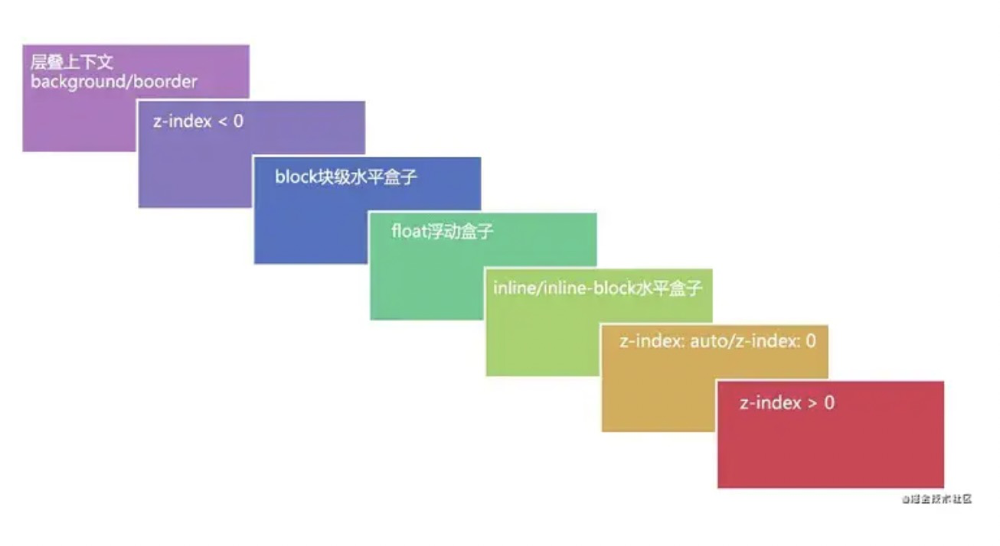

# Knowledge

## 1、BFC相关

> BFC(Block formatting context)直译为"块级格式化上下文"。

在讲BFC之前得先说下display的属性值，只有它符合成为条件才资格触发BFC机制

> 不是所有的元素模式都能产生BFC，w3c 规范： display 属性为 block, list-item, table 的元素，会产生BFC.

### 什么情况下可以让元素产生BFC

要给这些元素添加如下属性就可以触发BFC。

- float属性不为none

- position为absolute或fixed

- display为inline-block, table-cell, table-caption, flex, inline-flex

- overflow不为visible。

### BFC元素所具有的特性

- 在BFC中，盒子从顶端开始垂直地一个接一个地排列

- 盒子垂直方向的距离由margin决定。属于同一个BFC的两个相邻盒子的margin会发生重叠

- 在BFC中，每一个盒子的左外边缘（margin-left）会触碰到容器的左边缘(border-left)（对于从右到左的格式来说，则触碰到右边缘）。
    
    - BFC的区域不会与浮动盒子产生交集，而是紧贴浮动边缘。
    
    - 计算BFC的高度时，自然也会检测浮动或者定位的盒子高度

### BFC的主要用途

**(1) 清除元素内部浮动**

只要把父元素设为BFC就可以清理子元素的浮动了，最常见的用法就是在父元素上设置overflow: hidden样式

**(2) 解决外边距合并(塌陷)问题**

盒子垂直方向的距离由margin决定。属于同一个BFC的两个相邻盒子的margin会发生重叠

属于同一个sBFC的两个相邻盒子的margin会发生重叠，那么我们创建不属于同一个BFC，就不会发生margin重叠了。

**(3) 制作右侧自适应的盒子问题**

普通流体元素BFC后，为了和浮动元素不产生任何交集，顺着浮动边缘形成自己的封闭上下文

> 总结：BFC就是页面上的一个隔离的独立容器，容器里面的子元素不会影响到外面的元素。反之也如此。包括浮动，和外边距合并等等，因此，有了这个特性，我们布局的时候就不会出现意外情况了。

## 2、IFC相关

> IFC（inline Formatting Context）叫做“行级格式化上下”相对BFC比较简单且问的也不是很多，这里大该做个了解

布局规则如下：

- 内部的盒子会在水平方向，一个个地放置(默认就是IFC)；

- IFC的高度，由里面最高盒子的高度决定(里面的内容会撑开父盒子）；

- 当一行不够放置的时候会自动切换到下一行；


## 3、哪些属性开启了性能加速

硬件加速：就是将浏览器的渲染过程交给GPU(Graphics Processing Unit)处理，而不是使用自带的比较慢的渲染器。这样就可以使得**animation**与**transition**更加顺畅

我们可以在浏览器中用CSS开启硬件加速，使GPU发挥功能，从而提升性能

所谓GPU，就是图形处理器的缩写，相当于PC中的显卡。手机中的GPU也是为了对图形、图像处理而存在的，所谓强制渲染，就是hwa（hardware acceleration硬件加载）的一种，其存在的意义就是为了分担cpu的负担，其原理是通过GPU对软件图形的处理来减轻CPU的负担。从而使应用软件能够以更快的速度被处理，以达到提速的目的。

### 硬件加速的原理

浏览器接收到页面文档后，会将文档中的标记语言解析为DOM树。DOM树和CSS结合后形成浏览器构建页面的渲染树。渲染树中包含大量的渲染元素，每个渲染元素会被分到一个图层中，每个图层又会被加载到GPU形成渲染纹理，而图层在GPU中transform是不会触发repaint的，最终这些使用transform的图层都会由独立的合成器进程进行处理, CSS transform会**创建了一个新的复合图层，可以被GPU直接用来执行transform操作**。

### 浏览器什么时候会创建一个独立的复合图层呢？事实上一般是在以下几种情况下：

- 3D或者CSS transform

- video 和 canvas 标签

- css filters(滤镜效果)

- 元素覆盖时，比如使用了z-index属性

### 为什么硬件加速会使页面流畅

因为transform属性不会触发浏览器的repaint（重绘），而绝对定位absolute中的left和top则会一直触发repaint（重绘）。

### 为什么transform没有触发repaint呢？

简而言之，transform动画由GPU控制，支持硬件加载，并不需要软件方面的渲染。并不是所有的CSS属性都能触发GPU的硬件加载，事实上只有少数的属性可以，比如transform、opacity、filter

### 如何用CSS开启硬件加速

当浏览器检测到页面中某个DOM元素应用了某些CSS规则时就会开启，最显著的特征的元素是3D变化。

```css
.cube{
    translate3d(250px,250px,250px);
    rotate3d(250px,250px,250px,-120deg)
    scale3d(0.5,0.5,0.5);
}
```

> 可能在一些情况下，我们并不需要对元素应用3D变幻的效果，那怎么办呢?这时候我们可以使用“欺骗”浏览器来开启硬件加速。虽然我们可能不想对元素应用3D变幻，可我们一样可以开启3D引擎。例如我们可以用**transform:translateZ(0)**;来开启硬件加速


## 4. CSS选择器

CSS 几种常见选择器优先级是：**!important > 内联 > ID选择器 > 类选择器 > 标签选择器 > 通用选择器**

- ID选择器

- 类选择器

- 标签选择器

- 后代元素选择器

    - 作用：选中指定元素的指定后代元素。语法：祖先元素 后代元素 {}（空格隔开）
- 子元素选择器

    - 作用：选择指定父元素的指定子元素。语法：父元素 > 子元素

- 伪类

    - 伪类 表示元素的一种特殊状态

    - :active	向被激活的元素添加样式

    - :focus	向拥有键盘输入焦点的元素添加样式

    - :hover	当鼠标悬浮在元素上方时，向元素添加样式

    - :link	向未被访问的链接添加样式

    - :visited	向已被访问的链接添加样式。（隐私问题只能设置颜色）

    - :first-child	向元素的第一个子元素添加样式

    - :lang	向带有指定 lang 属性的元素添加样式

    - ::selection 匹配被用户选中或处于高亮状态的部分

- 伪元素
    
    - :伪元素 表示元素中一些特殊的位置
    
    - :first-letter 向文本的第一个字母添加特殊样式。
    
    - :first-line 向文本的首行添加特殊样式。
    
    - :before 在元素之前添加内容。
    
    - :after 在元素之后添加内容

- 其他子元素选择器

    - :first-child 指定父元素中第一个元素且为指定元素的样式

## 5. 如何清除浮动

- 给浮动元素的父元素添加高度

- 在最后一个子元素新添加最后一个冗余元素，然后将其设置clear:both，这样就可以清除浮动

- 伪元素清除( 手写clearfix )

```css
.clearfix:after {
    content: '';
    display: block;
    clear: both;
}
```

- 给父元素使用overflow:hidden

## 6. em、rem区别

em可以说是相对于父级元素的字体大小，当父级元素字体大小改变时，又得重新计算

rem只相对于根目录，即HTML元素。有了rem这个单位，我们只需要调整根元素html的font-size就能达到所有元素的动态适配了

## 7. 重绘与回流（重排）

重绘不一定导致回流，回流一定会导致重绘

- 回流：当我们对 DOM 的修改引发了 DOM 几何尺寸的变化（比如修改元素的宽、高或隐藏元素等）时，浏览器需要重新计算元素的几何属性（其他元素的几何属性和位置也会因此受到影响），然后再将计算的结果绘制出来。这个过程就是回流（也叫重排）

    - 最“贵”的操作：改变 DOM 元素的几何属性

    - “价格适中”的操作：改变 DOM 树的结构

    - 最容易被忽略的操作：获取一些特定属性的值。当你要用到像这样的属性：offsetTop、offsetLeft、 offsetWidth、offsetHeight、scrollTop、scrollLeft、scrollWidth、scrollHeight、clientTop、clientLeft、clientWidth、clientHeight

- 重绘：当我们对 DOM 的修改导致了样式的变化、却并未影响其几何属性（比如修改了颜色或背景色）时，浏览器不需重新计算元素的几何属性、直接为该元素绘制新的样式（跳过了上图所示的回流环节）。这个过程叫做重绘

## 8. position粘性定位

sticky 粘性定位( 建议结合具体实践操作来进行理解，有的面试官会深挖 )

- sticky 英文字面意思是粘，粘贴，所以可以把它称之为粘性定位

- position: sticky; 基于用户的滚动位置来定位

- 粘性定位的元素是依赖于用户的滚动，在 position:relative 与 position:fixed 定位之间切换

- 它的行为就像 position:relative; 而当页面滚动超出目标区域时，它的表现就像position:fixed;，它会固定在目标位置

- 元素定位表现为在跨越特定阈值前为相对定位，之后为固定定位

- 这个特定阈值指的是 top，right， bottom 或 left 之一，换言之，指定 top， right，bottom 或 left 四个阈值其中之一，才可使粘性定位生效。否则其行为与相对定位相同

## 9. display:none与visibility:hidden

display:none
    
- 如果给一个元素设置了display: none，那么该元素以及它的所有后代元素都会隐藏，它是前端开发人员使用频率最高的一种隐藏方式。隐藏后的元素无法点击，无法使用屏幕阅读器等辅助设备访问，占据的空间消失

visibility: hidden

- 给元素设置visibility: hidden也可以隐藏这个元素，但是隐藏元素仍需占用与未隐藏时一样的空间，也就是说虽然元素不可见了，但是仍然会影响页面布局

## 10. style在body前与在body后的区别

写在body标签前利于浏览器逐步渲染

写在body标签后：由于浏览器以逐行方式对html文档进行解析，当解析到写在尾部的样式表（外联或写在style标签）会导致浏览器停止之前的渲染，等待加载且解析样式表完成之后重新渲染

## 11. Flex实现的原理

## 12. 标准盒子模型于IE盒子模型区别

两者width不一样，标准盒子模型的 Width = content，IE盒子模型的Width = border + padding + content

## 13. z-index失效的场景

主要考察对层叠上下文的概念、以及层叠顺序、层叠等级的优先级问题（[具体学习请参考彻底搞懂CSS层叠上下文、层叠等级、层叠顺序、z-index](https://juejin.cn/post/6844903667175260174)）

- 层叠上下文：层叠上下文(stacking context)，是HTML中一个三维的概念。在CSS2.1规范中，每个盒模型的位置是三维的，分别是平面画布上的X轴，Y轴以及表示层叠的Z轴。一般情况下，元素在页面上沿X轴Y轴平铺，我们察觉不到它们在Z轴上的层叠关系。而一旦元素发生堆叠，这时就能发现某个元素可能覆盖了另一个元素或者被另一个元素覆盖

- 层叠等级：在同一个层叠上下文中，它描述定义的是该层叠上下文中的层叠上下文元素在Z轴上的上下顺序

- 如何产生“层叠上下文”

    - HTML中的根元素本身j就具有层叠上下文，称为“根层叠上下文”

    - 普通元素设置position属性为非static值并设置z-index属性为具体数值，产生层叠上下文

    - CSS3中的新属性也可以产生层叠上下文

- 层叠顺序：按照如下图排列



## 14. CSSOM生成规则

构建CSSOM（CSS对象模型 - CSS Object Model）

- 构建CSSOM的过程与构建DOM的过程非常相似，当浏览器接收到一段CSS，浏览器首先要做的是识别出Token，然后构建节点并生成CSSOM（规则如下）

- Bytes → characters → tokens → nodes → CSSOM

##
##
##
##
##
##
##
##
##
##
##
##