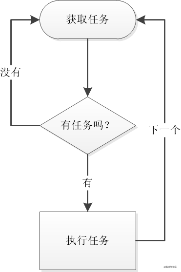
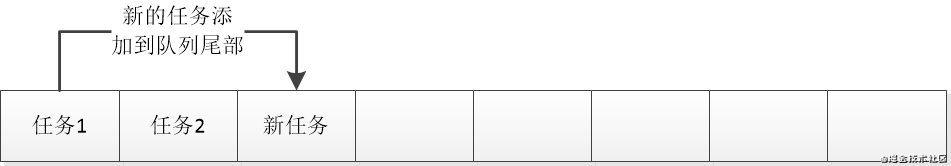
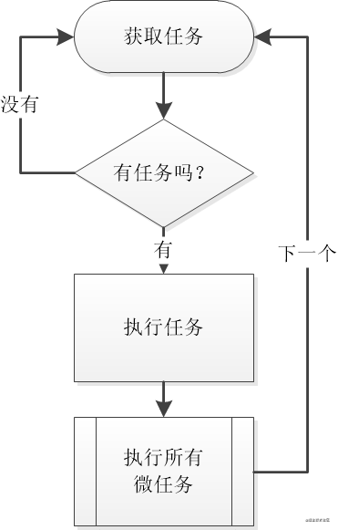

<!--
 * @Author: Li Zhiliang
 * @Date: 2021-01-11 16:58:17
 * @LastEditors: Li Zhiliang
 * @LastEditTime: 2021-03-01 14:54:10
 * @FilePath: /FE-Interview.git/javascript/event.md
-->
# 浏览器的事件机制

## 事件流

JS 与 HTML 的交互是用事件实现的。事件流描述了页面接收事件的顺序。

"DOM2级事件"规定的事件流包括三个阶段：

- 事件捕获阶段

- 处于目标阶段

- 事件冒泡阶段。 

### 事件冒泡

事件冒泡是 IE 团队提出的事件流方案，根据名字我们就可以看出，事件冒泡是从最具体的元素开始触发事件，然后向上传播至没有那么具体的元素（或文档）。


```html
<!DOCTYPE html>
<html lang="en">
<head>
  <meta charset="UTF-8">
  <meta name="viewport" content="width=device-width, initial-scale=1.0">
  <title>Document</title>
</head>
<body>
  <div id="div"> Click me</div>
</body>
<script>
  var div = document.querySelector('#div');
  div.addEventListener('click', () => {
    console.log('div click');
  })

  var body = document.querySelector('body');
  body.addEventListener('click', () => {
    console.log('body click');
  })

  var html = document.querySelector('html');
  html.addEventListener('click', () => {
    console.log('html click');
  })

  var document = document.querySelector('document');
  document.addEventListener('click', () => {
    console.log('document click');
  })
</script>
</html>
```

- 输出

```
div click
body click
html click
document click
```
所有的现代浏览器都是支持事件冒泡的。

### 事件捕获

事件捕获是 Netscape 开发团队提出的事件流解决方案。和事件冒泡相反，事件捕获是从最不具体的节点最先接收事件，向下传播至最具体的节点。事件捕获实际上是为了在事件到达最终目标前拦截事件。


```html
<!DOCTYPE html>
<html lang="en">
<head>
    <meta charset="UTF-8">
    <title>事件冒泡</title>
</head>
<body>
    <div>
        <p id="parEle">我是父元素    <span id="sonEle">我是子元素</span></p>
    </div>
</body>
</html>
<script type="text/javascript">
var sonEle = document.getElementById('sonEle');
var parEle = document.getElementById('parEle');

parEle.addEventListener('click', function () {
    alert('父级 冒泡');
}, false);
parEle.addEventListener('click', function () {
    alert('父级 捕获');
}, true);

sonEle.addEventListener('click', function () {
    alert('子级冒泡');
}, false);
sonEle.addEventListener('click', function () {
    alert('子级捕获');
}, true);

</script>
```

当容器元素及嵌套元素，即在捕获阶段又在冒泡阶段调用事件处理程序时：事件按DOM事件流的顺序执行事件处理程序：

- 父级捕获

- 子级冒泡

- 子级捕获

- 父级冒泡

且当事件处于目标阶段时，事件调用顺序决定于绑定事件的书写顺序，按上面的例子为，先调用冒泡阶段的事件处理程序，再调用捕获阶段的事件处理程序。依次alert出“子集冒泡”，“子集捕获”。

### IE兼容

- attchEvent('on' + type, handler)

- detachEvent('on' + type, handler)

## 事件处理程序

为了响应用户或者浏览器执行的某种动作（ click 、 load 、 mouseover ... ）而调用的 on 开头的函数被称为事件处理程序（事件监听器）。

### 事件是如何实现的？

基于发布订阅模式，就是在浏览器加载的时候会读取事件相关的代码，但是只有实际等到具体的事件触发的时候才会执行。

### HTML 事件处理程序

特定的元素支持的每个事件都可以用 HTML 属性的形式使用事件处理程序。其实也就是我们最常使用的方式，如下代码， onclick  属性的值是 JS 代码或者其他的调用方法。

使用事件监听器，浏览器会先创建一个函数来封装属性的值，这个函数有一个特殊的局部变量：event 用来保存 event 对象，事件处理函数中的 this 指向事件的目标元素。

```html
<input type="button" value="click me" onclick="console.log('click')" />
```

### DOM0 事件处理程序

在 JavaScript 中创建事件监听器的传统方式是把一个函数赋值给 DOM 元素。兼容性最好，所有的浏览器都支持此方法。

每个元素（包括 window 和 document）都有事件处理程序的属性（一般都 onxxxx），这个属性的值为一个函数。

```js
const btn = document.getElementById("myBtn");
btn.onclick = function(){
  console.log('Clicked')
}
```

这样使用 DOM0 事件处理是发生在程序赋值时注册在事件流的冒泡阶段的。

所赋值的函数被视为元素的方法，在元素的作用域中运行，this 指向该元素本身。在事件处理程序中通过 this 可以访问元素的任何属性和方法。

将事件处理程序属性设置为 null，即可移除通过 DOM0 方式添加的事件处理程序。

```js
btn.onclick = null;
```

如果有多个 DOM0 事件处理程序的话，后面的是会把前面的给覆盖掉。只有执行最后一个调用的结果。

### DOM2 事件处理程序

我们也可以通过在所有的 DOM 节点上通过 addEventListener() 和 removeEventLinstener() 来添加和移除事件处理程序。

addEventListener() 和 removeEventLinstener() 接收 3 个参数：**事件名****、事件处理函数** 和 **一个 option 对象或一个布尔值 useCapture**（ true  表示在捕获阶段调用事件处理程序， false （默认值）表示在冒泡阶段调用事件处理程序，因为跨浏览器兼容性好，所以事件处理程序默认会被添加到事件流的冒泡阶段（也就是默认最后一个参数为 false ））。

**addEventListener(type, listener, useCapture | options)**

option 参数有一下几个选择

```html
capture:  Boolean，表示 listener 会在该类型的事件捕获阶段传播到该 EventTarget 时触发。

once:  Boolean，表示 listener 在添加之后最多只调用一次。如果是 true， listener 会在其被调用之后自动移除。

passive: Boolean，设置为true时，表示 listener 永远不会调用 preventDefault()。如果 listener 仍然调用了这个函数，客户端将会忽略它并抛出一个控制台警告。
```

useCapture 参数如下

```js
useCapture  可选
Boolean，在DOM树中，注册了listener的元素， 是否要先于它下面的EventTarget，调用该listener。 当useCapture(设为true) 时，沿着DOM树向上冒泡的事件，不会触发listener。当一个元素嵌套了另一个元素，并且两个元素都对同一事件注册了一个处理函数时，所发生的事件冒泡和事件捕获是两种不同的事件传播方式。事件传播模式决定了元素以哪个顺序接收事件。进一步的解释可以查看 事件流 及 JavaScript Event order 文档。 如果没有指定， useCapture 默认为 false 。
```

简单的说，我个人的理解是 useCapture 参数指定了该事件处理程序触发的“时机” ：是在事件流的捕获阶段还是冒泡阶段。但是，无论最后一个参数设置为什么，都不会阻碍事件流的传播。

> Event 接口的 **preventDefault()**方法，告诉user agent：如果此事件没有被显式处理，它默认的动作也不应该照常执行。此事件还是继续传播，除非碰到事件侦听器调用stopPropagation() 或stopImmediatePropagation()，才停止传播。

以上代码为会在事件流的指定阶段触发 click 的事件处理程序。与 DOM0 类似，这个事件处理程序同样被附加在元素的作用域中运行，所以，事件处理函数中的 this 指向的是该元素。

DOM2 事件处理程序的一个优点是可以给一个元素添加多个事件处理程序，并按添加的顺序触发。

使用addEventListener() 添加的事件处理程序只能使用 removeEventLinstener()移除（三个参数均一致才可以）；**所以，使用匿名函数添加的事件处理程序是不能被移除的。**

### IE 事件处理程序

IE 实现事件处理程序的方法是： attachEvent() 和 detachEvent() 这两个方法接收两个同样的参数：事件处理程序的名称（ eg: onclick ）和事件处理函数。因为 IE8 及更早的版本只支持事件冒泡，所以使用 attachEvent() 添加的事件处理程序是添加在冒泡阶段。

```js
const btn = document.getElementById("myBtn");

btn.attachEvent("onclick", function(){
  console.log("Clicked");
})
```

IE 事件处理程序和 DOM2 事件处理程序有两个不一样的地方

1. 作用域：attachEvent()是在全局作用域中运行的，所以 attachEvent() 中的函数中的 this 是 window；

2. 执行顺序：IE 事件处理程序的执行顺序是和添加顺序相反的。

### 四种事件处理程序的区别


## 事件对象

在 DOM 中发生事件时，所有的相关信息都会被收集在一个名为 event 的对象中。这个对象包含了一些基本信息：触发事件的元素、事件的类型、以及一些与特定事件相关的其他数据（比如和鼠标事件相关的鼠标的位置信息）所有的浏览器都是支持这个 event 对象的。

```js
btn.onclick = function(event){
  console.log(event.type)     // click
}

btn.addEventListener("click", () => {
  console.log(event.type);    // click
}, false);
```

### DOM 事件对象 event

在事件处理函数的内部，this 对象始终等于 currentTarget (因为 this 是指向调用的对象的)。

target 是事件触发的实际目标。（事件冒泡阶段可能出现 target 和 currentTarget 不相等的情况。

```html
<!DOCTYPE html>
<html lang="en">
<head>
  <meta charset="UTF-8">
  <meta name="viewport" content="width=device-width, initial-scale=1.0">
  <title>Document</title>
</head>
<body>
  <div id="div"> Click me</div>
</body>
<script>
  var div = document.querySelector('#div');
  div.addEventListener('click', function(e){
    console.log('div click', e.currentTarget === this);    // true 
    console.log('div click', e.target === this);           // true
  })

  var body = document.querySelector('body');
  body.addEventListener('click', function(e){
    console.log('body click', e.currentTarget === this);   // true
    console.log('body click', e.target === this);          // false
  })
</script>
</html>
```

- preventDefault()

preventDefault() 方法用于阻止事件的默认行为（比如，a 标签有跳转到 href 链接的默认行为，使用 preventDefault() 可以阻止这种导航行为）

preventDefault()阻止的必需是可 cancelable 的元素 **

```js
const link = document.getElementById("myLink");

link.onclick = function(event){
  event.preventDefault();
}
```

- stopPropagation()

stopPropagation() 方法用于立即阻止事件流在 DOM 中的传播，取消后续的事件捕获或冒泡。比如

```js
var div = document.querySelector('#div');

div.addEventListener("click", (e) => {
  console.log("clicked");
  e.stopPropagation()
}, false);

document.body.addEventListener("click", () => {
  console.log("body clicked");
}, false);

// clicked 
```

如果不调用 stopPropagation() 那么点击 div 会有两个 log 记录。如果加上的话，click 事件就不会传播到 body 上，只会有一个 log 记录（ clicked ）。

### IE 事件对象

IE 就是这么的与众不同（手动危笑）IE 事件对象是根据使用的事件处理程序不同而不同。

- 使用 DOM0 事件处理程序，event 对象是全局对象 window 的一个属性

- 使用 attachEvent() / HTML 属性方法处理事件处理程序，event 对象会作为唯一的参数传给处理函数（event 仍然是 window 对象的属性，只是方便将其作为参数参入）

```js
var div = document.querySelector('#div');

div.onclick = function(){
  let event = window.event;
  console.log(evennt.type);     // click
}

div.attachEvent('onclick', function(event){
  console.log(event.type);      // click
})
```

## 事件循环（EventLoop）

### 1. 什么是事件循环？

所有的语言都拥有并发模型的概念，也就是说多个任务如何同时执行，大部分语言支持多线程执行，JS拥有所有语言中最简单的并发模型——JS使用单线程的"**事件循环(Event Loop)**"来处理多个任务的执行

```js
while(获取任务()){
  执行任务();
}
```

简单来说，js的事件循环，每次读取一个任务，然后执行这个任务，执行完再继续获取下一个，如果暂时没有任务，就暂停执行，等待下一个任务到来；如果在执行任务的过程中有新的任务到达，也不会中断现有任务的执行，而是添加到队列的尾部等待



结论是，JS使用基于**事件循环的单线程执行方式**，而且是非抢断执行的（也就是说，无论发生什么，都会把当前任务执行完，不会出现执行到一半就去执行别的任务的情况）

| | 多线程(C、Java等语言)|	单线程事件驱动(JavaScript)|
| ---- | ---- | ----- |
|复杂性	| 复杂度高，需要面对线程间同步等大量消耗头发的问题	| 简单易于使用，永远不会出现资源争抢的问题|
|性能	| CPU性能很高，适合计算密集型任务	| 单一线程，无法发挥CPU的极限性能（可通过webWorker补充），不过前端应用本就不是计算密集型的|
|阻塞	|不会阻塞，大型任务可以单开线程处理	 | 其实也不会阻塞，因为JS中的IO任务都是异步的（文件、网络），虽然大型计算任务依然会阻塞UI线程，但这种情况对前端其实不多|

#### 任务队列的概念

理解了事件循环的概念，我们来继续看看任务队列，所谓**任务队列，其实就是保存待处理任务的一个数组**



每当我们要执行一个新的任务（例如：定时器），我们就会在队列尾部添加一个task，等到当前任务完成，事件循环会去队列头部寻找下一个可执行任务，我们用一个例子来更好的理解这一点

```js
console.log('aaaa');

setTimeout(()=>{
  console.log('cccc');
}, 0);  //这个0毫秒是重点

console.log('bbbb');
```

```
aaaa
bbbb
cccc
```

- 第1步：它会先执行console.log('aaaa')，很普通的同步代码

- 第2步：定时器是这个问题的关键，尤其是0毫秒的
    
    - 0毫秒意味着没有延迟，所以本应直接执行console.log('cccc')，但是...
    
    - 定时器不会立刻执行，因为它不能打断当前任务（JS是非抢断执行），所以它只能被放到队列的尾部

- 第3步：执行console.log('bbb')

- 第4步：当前任务已经执行完成了，这时才会从任务队列中寻找下一个任务（也就是之前放入的定时器任务）

- 第5步：执行定时器任务，也就是console.log('cccc')

### 2. 什么是宏任务和微任务？

其实js里任务队列不只有一条，而是有两条，而且有一条还是SVIP年费白金队列

- 宏任务（macroTask或简称Task）：普通的任务，正常执行

  - 常见的宏任务:script(整体代码), XHR回调,setTimeout, setInterval, setImmediate（node独有）, I/O.

- 微任务（microTask）：SVIP年费白金会员任务，优先于宏任务执行（但依然是非抢断的）, 微任务是宏任务的组成部分,微任务与宏任务是包含关系,并非前后并列.如果要谈微任务,需要指出它属于哪个宏任务才有意义.

  - process.nextTick(nodejs端),Promise.then的回调等.



在考虑微任务的情况下，JS的事件循环是按照这样的顺序执行：

- 获取下一个任务，如果没有就进入等待

- 当执行完一个任务之后，会执行所有排队的微任务

- 然后再次获取下一个任务

```js
while(获取任务()){
  执行任务();
  
  微任务队列.forEach(微任务=>{
    执行微任务();
  });
}
```

所以，微任务其实比普通任务的优先级更高，因为在一个任务结束后，事件循环会找到并执行全部微任务，然后再继续查找其他任务，但这时候我们会有两个问题：

#### 哪些操作属于宏任务？哪些属于微任务？

最早的js只有宏任务，而微任务是后来才加的

- 宏任务：正常的异步任务都是宏任务，最常见的就是定时器（setInterval, setImmediate, setTimeout）、IO任务

- 微任务：微任务出现比较晚，queueMicrotask、Promise和async属于微任务（当然，async就是promise）

例子：

```js
console.log('aaa');

setTimeout(() => console.log(111), 0); //异步任务
queueMicrotask(() => console.log(222)); //异步任务

console.log('bbb');
```

```
aaa
bbb
222
111
```

- 第1步，毫无疑问的，肯定是先执行aaa，这个没任何疑问

- 第2步，定时器肯定不是立刻执行，所以111去排队了，但是注意，定时器是宏任务

- 第3步，queueMicrotask也不会立即执行，所以222也去排队了，但Promise进的是VIP队列

- 第4步，执行到bbb了，而且当前任务就结束了，接下来是重点

- 第5步，再次查询任务之前（也就是那个while），会先完成所有微任务，所以此时，222得到优先执行，毕竟是VIP嘛

- 第6步，完成所有微任务后（也就是第5步），会寻找下一个任务，这时111的那个定时器才得到执行

> 所以，整个执行过程是aaa,bbb,111,222，现在我们也明白了微任务是什么，其实微任务就是得到优先执行的异步任务

> 按照官方的设想，任务之间是不平等的，有些任务对用户体验影响大，就应该优先执行，而有些任务属于背景任务（比如定时器），晚点执行没有什么问题，所以设计了这种优先级队列的方式

### 拓展

#### 1. 定时器为什么总是不准？

大家一定注意过一个事情，那就是JS中的定时器经常不准（其实所有语言都这样），这个问题也跟上面的任务队列有关

- 定时器的时间，并不是函数执行的时间，而是"最短x毫秒后，将任务添加到队列中"

- 也就是说，除非队列完全是空的，否则定时器的时间到了，它仅仅是开始排队罢了

- 那么，队列有可能永远是空的吗？显然不可能，就算没有你的任务，浏览器也有很多它的工作——渲染、重排、清理内存什么的

所以结论就是，因为有其他任务在排队，定时器永远不可能完全准时

#### 2. async的坑

上面我们说到Promise也是微任务，而且async就是promise的一种语法包装（所谓语法糖），那async是不是一定是按照微任务的方式执行呢？"不全是"

```js
console.log('aaa');

(async ()=>{
  console.log(111);  //在async里面
})().then(()=>{
  console.log(222);  //在async的then里面
});

console.log('bbb');
```

```
aaa
111
bbb
222
```

- 第1步，依然是毫无悬念的aaa，过

- 第2步，虽然async是异步操作，但async函数本身（也就是111所在的()=>{}），其实依然是同步执行的，除非有await出现，这个下面会说，所以，这里111会**直接同步执行**，而不是放到队列里等待

- 第3步，重点来了，then不会同步执行，它才是异步的，而且是一个微任务，所以222不会立即执行，而是排到队列尾部

- 第4步，执行bbb没什么好说的，而且当前任务也就执行完成了

- 第5步，最后从任务队列中把排队的222拿出来，完成整个程序

那么，再来看看await的作用吧，await其实是异步的，跟then差不多（从语法上来说，await其实就是promise的then），直接上例子

```js
console.log('aaa');

(async ()=>{
  console.log(111);
  await console.log(222);
  console.log(333);
})().then(()=>{
  console.log(444);
});

console.log('ddd');
```

```
aaa
111
222
ddd
333
444
```

- 第1步、aaa不说了

- 第2步、111是同步执行的，上面说过

- 第3步、222这里很重要了，首先，console.log自己是同步的，所以立即就会执行，我们能直接看到222，但是await本身就是then，所以console.log(333)无法直接执行，而是老老实实去排队，而且，因为整个async并未执行完，它的then（也就是444）无法触发

- 第4步、ddd应该也不用说，当前任务到这里执行完毕

- 第5步、从任务队列中把333拉出来，并且执行了，这时整个async才算完成，所以把then推到队列中等待执行

- 第6步、把console.log(444)拉出来执行，看到444

> 所以，一个结论是，await其实等价于then（事实上他俩也确实是一个东西），都是将后续任务放到微任务队列中等待，而不会立即执行

例子：

```js
console.log('aaa');

setTimeout(()=>console.log('t1'), 0);
(async ()=>{
  console.log(111);
  await console.log(222);
  console.log(333);

  setTimeout(()=>console.log('t2'), 0);
})().then(()=>{
  console.log(444);
});

console.log('bbb');
```

- 第1步、毫无悬念aaa，过

- 第2步、t1会放入任务队列等待

- 第3步、111会直接执行，因为async本身不是异步的（上面有说）

- 第4步、222也会直接执行，但是接下来的console.log(333);和setTimeout(()=>console.log('t2'), 0);就塞到微任务队列里等待了

- 第5步、bbb毫无疑问，而且当前任务完成，优先执行微任务队列，也就是console.log(333)开始的那里

- 第6步、执行333，然后定时器t2会加入任务队列等待（此时的任务队列里有t1和t2两个了），并且async完成，所以console.log(444)进入微任务队列等待

- 第7步、优先执行微任务，也就是444，此时所有微任务都完成了

- 第8步、执行剩下的普通任务队列，这时t1和t2才会出来

#### 3. dom操作属于宏任务还是微任务

```js
 console.log(1);
 document.getElementById("div").style.color = "red";
 console.log(2);
```

在实践中发现,当上面代码执行到第三行时,控制台输出了1并且页面已经完成了重绘,div的颜色变成了红色.

dom操作它既不是宏任务也不是微任务,它应该归于同步执行的范畴.

#### 4. requestAnimationFrame属于宏任务还是微任务

```js
setTimeout(() => {
  console.log("11111")
}, 0)
requestAnimationFrame(() => {
   console.log("22222")
})
new Promise(resolve => {
  console.log('promise');
  resolve();
})
.then(() => {console.log('then')})
```

执行结果: promise -- then -- 22222 -- 11111

很多人会把 requestAnimationFrame 归结到宏任务中,因为发现它会在微任务队列完成后执行.

但实际上 requestAnimationFrame 它既不能算宏任务,也并非是微任务.它的执行时机是在当前宏任务范围内,执行完同步代码和微任务队列后再执行.它仍然属于宏任务范围内,但是是在微任务队列执行完毕后才执行.

#### Promise的运行机制

**包裹函数是同步代码**

```js
 new Promise((resolve)=>{
    console.log(1);
	resolve();
  }).then(()=>{
    console.log(2);
 })
```

new Promise里面的包裹的函数,也就是输出1的那段代码是同步执行的.而then包裹的函数才会被加载到微任务队列中等待执行.

### 总结：

- 事件循环：JS采用单线程的事件循环方式管理异步任务，优点是简化编程模型，缺点是无法发挥CPU的全部性能（但对前端其实没影响）

- 任务队列：JS采用非抢断式运行，当前任务不会被打断，有新的异步任务时，会放入任务队列

- 宏任务、微任务：宏任务就是普通异步任务，是最早出现的，微任务更关乎用户体验，所以得到优先执行

- 常见宏任务：定时器、IO任务

- 常见微任务：queueMicrotask、await、then


