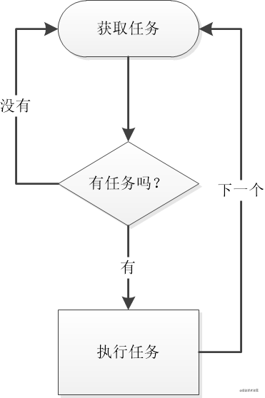
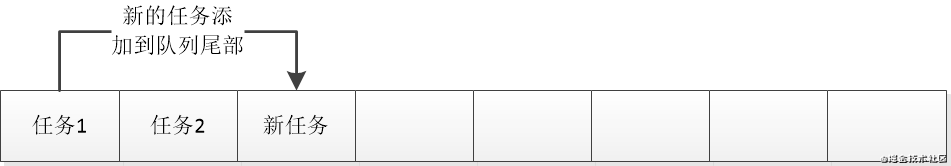
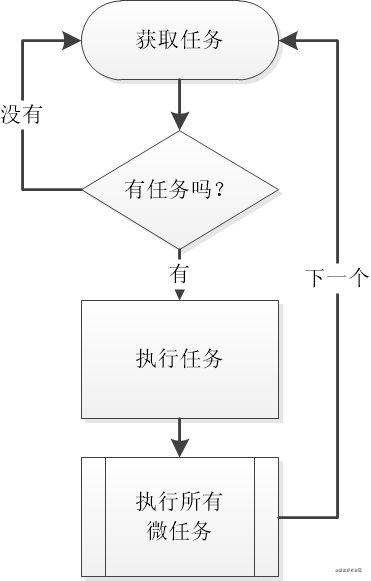

<!--
 * @Author: Li Zhiliang
 * @Date: 2020-11-20 14:49:52
 * @LastEditors: Li Zhiliang
 * @LastEditTime: 2020-12-14 22:22:38
 * @FilePath: /FE-Interview.git/javascript/eventLoop.md
-->
# 事件循环（EventLoop）

## 1. 什么是事件循环？

所有的语言都拥有并发模型的概念，也就是说多个任务如何同时执行，大部分语言支持多线程执行，JS拥有所有语言中最简单的并发模型——JS使用单线程的"**事件循环(Event Loop)**"来处理多个任务的执行

```js
while(获取任务()){
  执行任务();
}
```

简单来说，js的事件循环，每次读取一个任务，然后执行这个任务，执行完再继续获取下一个，如果暂时没有任务，就暂停执行，等待下一个任务到来；如果在执行任务的过程中有新的任务到达，也不会中断现有任务的执行，而是添加到队列的尾部等待



结论是，JS使用基于**事件循环的单线程执行方式**，而且是非抢断执行的（也就是说，无论发生什么，都会把当前任务执行完，不会出现执行到一半就去执行别的任务的情况）

| | 多线程(C、Java等语言)|	单线程事件驱动(JavaScript)|
| ---- | ---- | ----- |
|复杂性	| 复杂度高，需要面对线程间同步等大量消耗头发的问题	| 简单易于使用，永远不会出现资源争抢的问题|
|性能	| CPU性能很高，适合计算密集型任务	| 单一线程，无法发挥CPU的极限性能（可通过webWorker补充），不过前端应用本就不是计算密集型的|
|阻塞	|不会阻塞，大型任务可以单开线程处理	 | 其实也不会阻塞，因为JS中的IO任务都是异步的（文件、网络），虽然大型计算任务依然会阻塞UI线程，但这种情况对前端其实不多|

### 任务队列的概念

理解了事件循环的概念，我们来继续看看任务队列，所谓**任务队列，其实就是保存待处理任务的一个数组**



每当我们要执行一个新的任务（例如：定时器），我们就会在队列尾部添加一个task，等到当前任务完成，事件循环会去队列头部寻找下一个可执行任务，我们用一个例子来更好的理解这一点

```js
console.log('aaaa');

setTimeout(()=>{
  console.log('cccc');
}, 0);  //这个0毫秒是重点

console.log('bbbb');
```

```
aaaa
bbbb
cccc
```

- 第1步：它会先执行console.log('aaaa')，很普通的同步代码

- 第2步：定时器是这个问题的关键，尤其是0毫秒的
    
    - 0毫秒意味着没有延迟，所以本应直接执行console.log('cccc')，但是...
    
    - 定时器不会立刻执行，因为它不能打断当前任务（JS是非抢断执行），所以它只能被放到队列的尾部

- 第3步：执行console.log('bbb')

- 第4步：当前任务已经执行完成了，这时才会从任务队列中寻找下一个任务（也就是之前放入的定时器任务）

- 第5步：执行定时器任务，也就是console.log('cccc')

## 2. 什么是宏任务和微任务？

其实js里任务队列不只有一条，而是有两条，而且有一条还是SVIP年费白金队列

- 宏任务（macroTask或简称Task）：普通的任务，正常执行

  - 常见的宏任务:script(整体代码), XHR回调,setTimeout, setInterval, setImmediate（node独有）, I/O.

- 微任务（microTask）：SVIP年费白金会员任务，优先于宏任务执行（但依然是非抢断的）, 微任务是宏任务的组成部分,微任务与宏任务是包含关系,并非前后并列.如果要谈微任务,需要指出它属于哪个宏任务才有意义.

  - process.nextTick(nodejs端),Promise.then的回调等.



在考虑微任务的情况下，JS的事件循环是按照这样的顺序执行：

- 获取下一个任务，如果没有就进入等待

- 当执行完一个任务之后，会执行所有排队的微任务

- 然后再次获取下一个任务

```js
while(获取任务()){
  执行任务();
  
  微任务队列.forEach(微任务=>{
    执行微任务();
  });
}
```

所以，微任务其实比普通任务的优先级更高，因为在一个任务结束后，事件循环会找到并执行全部微任务，然后再继续查找其他任务，但这时候我们会有两个问题：

### 哪些操作属于宏任务？哪些属于微任务？

最早的js只有宏任务，而微任务是后来才加的

- 宏任务：正常的异步任务都是宏任务，最常见的就是定时器（setInterval, setImmediate, setTimeout）、IO任务

- 微任务：微任务出现比较晚，queueMicrotask、Promise和async属于微任务（当然，async就是promise）

例子：

```js
console.log('aaa');

setTimeout(() => console.log(111), 0); //异步任务
queueMicrotask(() => console.log(222)); //异步任务

console.log('bbb');
```

```
aaa
bbb
222
111
```

- 第1步，毫无疑问的，肯定是先执行aaa，这个没任何疑问

- 第2步，定时器肯定不是立刻执行，所以111去排队了，但是注意，定时器是宏任务

- 第3步，queueMicrotask也不会立即执行，所以222也去排队了，但Promise进的是VIP队列

- 第4步，执行到bbb了，而且当前任务就结束了，接下来是重点

- 第5步，再次查询任务之前（也就是那个while），会先完成所有微任务，所以此时，222得到优先执行，毕竟是VIP嘛

- 第6步，完成所有微任务后（也就是第5步），会寻找下一个任务，这时111的那个定时器才得到执行

> 所以，整个执行过程是aaa,bbb,111,222，现在我们也明白了微任务是什么，其实微任务就是得到优先执行的异步任务

> 按照官方的设想，任务之间是不平等的，有些任务对用户体验影响大，就应该优先执行，而有些任务属于背景任务（比如定时器），晚点执行没有什么问题，所以设计了这种优先级队列的方式

## 拓展

### 1. 定时器为什么总是不准？

大家一定注意过一个事情，那就是JS中的定时器经常不准（其实所有语言都这样），这个问题也跟上面的任务队列有关

- 定时器的时间，并不是函数执行的时间，而是"最短x毫秒后，将任务添加到队列中"

- 也就是说，除非队列完全是空的，否则定时器的时间到了，它仅仅是开始排队罢了

- 那么，队列有可能永远是空的吗？显然不可能，就算没有你的任务，浏览器也有很多它的工作——渲染、重排、清理内存什么的

所以结论就是，因为有其他任务在排队，定时器永远不可能完全准时

### 2. async的坑

上面我们说到Promise也是微任务，而且async就是promise的一种语法包装（所谓语法糖），那async是不是一定是按照微任务的方式执行呢？"不全是"

```js
console.log('aaa');

(async ()=>{
  console.log(111);  //在async里面
})().then(()=>{
  console.log(222);  //在async的then里面
});

console.log('bbb');
```

```
aaa
111
bbb
222
```

- 第1步，依然是毫无悬念的aaa，过

- 第2步，虽然async是异步操作，但async函数本身（也就是111所在的()=>{}），其实依然是同步执行的，除非有await出现，这个下面会说，所以，这里111会**直接同步执行**，而不是放到队列里等待

- 第3步，重点来了，then不会同步执行，它才是异步的，而且是一个微任务，所以222不会立即执行，而是排到队列尾部

- 第4步，执行bbb没什么好说的，而且当前任务也就执行完成了

- 第5步，最后从任务队列中把排队的222拿出来，完成整个程序

那么，再来看看await的作用吧，await其实是异步的，跟then差不多（从语法上来说，await其实就是promise的then），直接上例子

```js
console.log('aaa');

(async ()=>{
  console.log(111);
  await console.log(222);
  console.log(333);
})().then(()=>{
  console.log(444);
});

console.log('ddd');
```

```
aaa
111
222
ddd
333
444
```

- 第1步、aaa不说了

- 第2步、111是同步执行的，上面说过

- 第3步、222这里很重要了，首先，console.log自己是同步的，所以立即就会执行，我们能直接看到222，但是await本身就是then，所以console.log(333)无法直接执行，而是老老实实去排队，而且，因为整个async并未执行完，它的then（也就是444）无法触发

- 第4步、ddd应该也不用说，当前任务到这里执行完毕

- 第5步、从任务队列中把333拉出来，并且执行了，这时整个async才算完成，所以把then推到队列中等待执行

- 第6步、把console.log(444)拉出来执行，看到444

> 所以，一个结论是，await其实等价于then（事实上他俩也确实是一个东西），都是将后续任务放到微任务队列中等待，而不会立即执行

例子：

```js
console.log('aaa');

setTimeout(()=>console.log('t1'), 0);
(async ()=>{
  console.log(111);
  await console.log(222);
  console.log(333);

  setTimeout(()=>console.log('t2'), 0);
})().then(()=>{
  console.log(444);
});

console.log('bbb');
```

- 第1步、毫无悬念aaa，过

- 第2步、t1会放入任务队列等待

- 第3步、111会直接执行，因为async本身不是异步的（上面有说）

- 第4步、222也会直接执行，但是接下来的console.log(333);和setTimeout(()=>console.log('t2'), 0);就塞到微任务队列里等待了

- 第5步、bbb毫无疑问，而且当前任务完成，优先执行微任务队列，也就是console.log(333)开始的那里

- 第6步、执行333，然后定时器t2会加入任务队列等待（此时的任务队列里有t1和t2两个了），并且async完成，所以console.log(444)进入微任务队列等待

- 第7步、优先执行微任务，也就是444，此时所有微任务都完成了

- 第8步、执行剩下的普通任务队列，这时t1和t2才会出来

### 3. dom操作属于宏任务还是微任务

```js
 console.log(1);
 document.getElementById("div").style.color = "red";
 console.log(2);
```

在实践中发现,当上面代码执行到第三行时,控制台输出了1并且页面已经完成了重绘,div的颜色变成了红色.

dom操作它既不是宏任务也不是微任务,它应该归于同步执行的范畴.

### 4. requestAnimationFrame属于宏任务还是微任务

```js
setTimeout(() => {
  console.log("11111")
}, 0)
requestAnimationFrame(() => {
   console.log("22222")
})
new Promise(resolve => {
  console.log('promise');
  resolve();
})
.then(() => {console.log('then')})
```

执行结果: promise -- then -- 22222 -- 11111

很多人会把 requestAnimationFrame 归结到宏任务中,因为发现它会在微任务队列完成后执行.

但实际上 requestAnimationFrame 它既不能算宏任务,也并非是微任务.它的执行时机是在当前宏任务范围内,执行完同步代码和微任务队列后再执行.它仍然属于宏任务范围内,但是是在微任务队列执行完毕后才执行.

### Promise的运行机制

**包裹函数是同步代码**

```js
 new Promise((resolve)=>{
    console.log(1);
	resolve();
  }).then(()=>{
    console.log(2);
 })
```

new Promise里面的包裹的函数,也就是输出1的那段代码是同步执行的.而then包裹的函数才会被加载到微任务队列中等待执行.


## 总结：

- 事件循环：JS采用单线程的事件循环方式管理异步任务，优点是简化编程模型，缺点是无法发挥CPU的全部性能（但对前端其实没影响）

- 任务队列：JS采用非抢断式运行，当前任务不会被打断，有新的异步任务时，会放入任务队列

- 宏任务、微任务：宏任务就是普通异步任务，是最早出现的，微任务更关乎用户体验，所以得到优先执行

- 常见宏任务：定时器、IO任务

- 常见微任务：queueMicrotask、await、then


