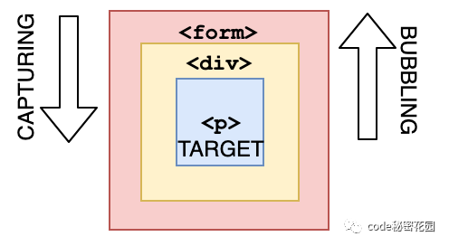
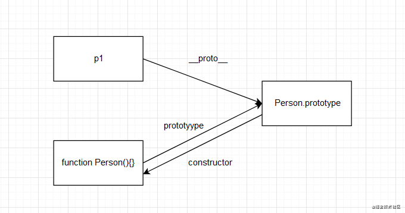
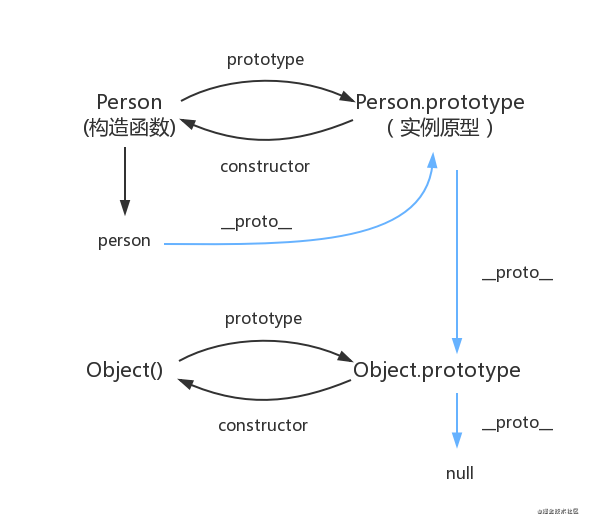

<!--
 * @Author: Li Zhiliang
 * @Date: 2020-11-18 11:03:22
 * @LastEditors: Li Zhiliang
 * @LastEditTime: 2020-12-26 15:27:01
 * @FilePath: /FE-Interview.git/javascript/knowledge.md
-->
# Knowledge

## 1. 事件传播的三个阶段是什么？

**捕获 > 目标 > 冒泡**

在捕获阶段，事件通过父元素向下传递到目标元素。 然后它到达目标元素，冒泡开始。



## 2. 所有对象都有原型吗？

**错误**

基础对象指原型链终点的对象。基础对象的原型是null。

> 除基础对象外，所有对象都有原型。 基础对象可以访问某些方法和属性，例如.toString。 这就是您可以使用内置JavaScript方法的原因！ 所有这些方法都可以在原型上找到。 虽然JavaScript无法直接在您的对象上找到它，但它会沿着原型链向下寻找并在那里找到它，这使您可以访问它。

## 3. JavaScript全局执行上下文为你创建了两个东西:全局对象和this关键字.

**对**

> 基本执行上下文是全局执行上下文:它是代码中随处可访问的内容。

## 4. Javascript中的假值

- undefined

- null

- NaN

- 0

- '' (empty string)

- false

## 5. `setInterval`方法的返回值什么?

- 它返回一个唯一的id。 此id可用于使用clearInterval()函数清除该定时器。

## 6. 如何解决a标点击后hover事件失效的问题?

改变a标签css属性的排列顺序

只需要记住LoVe HAte原则就可以了：

```
link→visited→hover→active
```

比如下面错误的代码顺序：

```css
a:hover{
  color: green;
  text-decoration: none;
}
a:visited{ /* visited在hover后面，这样的话hover事件就失效了 */
  color: red;
  text-decoration: none;
}
```
正确的做法是将两个事件的位置调整一下。

注意⚠️各个阶段的含义：

> a:link：未访问时的样式，一般省略成a a:visited：已经访问后的样式 a:hover：鼠标移上去时的样式 a:active：鼠标按下时的样式

## 7. 点击一个input依次触发的事件

```js
const text = document.getElementById('text');
text.onclick = function (e) {
  console.log('onclick')
}
text.onfocus = function (e) {
  console.log('onfocus')
}
text.onmousedown = function (e) {
  console.log('onmousedown')
}
text.onmouseenter = function (e) {
  console.log('onmouseenter')
}
```

Answer

```
'onmouseenter'
'onmousedown'
'onfocus'
'onclick'
```

## 8. null和undefined的区别

- null表示一个"无"的对象，也就是该处不应该有值；而undefined表示未定义。

- 在转换为数字时结果不同，Number(null)为0，而undefined为NaN。

**null：**

- 作为函数的参数，表示该函数的参数不是对象

- 作为对象原型链的终点

**undefined:**

- 变量被声明了，但没有赋值时，就等于undefined

- 调用函数时，应该提供的参数没有提供，该参数等于undefined

- 对象没有赋值属性，该属性的值为undefined

- 函数没有返回值时，默认返回undefined

## 9. docoment,window,html,body的层级关系

```js
window > document > html > body
```

**层级关系**

- window是BOM的核心对象，它一方面用来获取或设置浏览器的属性和行为，另一方面作为一个全局对象。

- document对象是一个跟文档相关的对象，拥有一些操作文档内容的功能。但是地位没有window高。

- html元素对象和document元素对象是属于html文档的DOM对象，可以认为就是html源代码中那些标签所化成的对象。他们跟div、select什么对象没有根本区别。

## 10. addEventListener函数的第三个参数

第三个参数涉及到冒泡和捕获，是true时为捕获，是false则为冒泡。

或者是一个对象{passive: true}，针对的是Safari浏览器，禁止/开启使用滚动的时候要用到。

## 11. 有写过原生的自定义事件吗

- 使用Event

- 使用customEvent （可以传参数）

- 使用document.createEvent('CustomEvent')和initEvent()

**创建自定义事件**

1. 使用Event

```js
let myEvent = new Event('event_name');
```

2. 使用customEvent （可以传参数）

```js
let myEvent = new CustomEvent('event_name', {
	detail: {
		// 将需要传递的参数放到这里
		// 可以在监听的回调函数中获取到：event.detail
	}
})
```

3. 使用document.createEvent('CustomEvent')和initEvent()

```js
let myEvent = document.createEvent('CustomEvent');// 注意这里是为'CustomEvent'
myEvent.initEvent(
	// 1. event_name: 事件名称
	// 2. canBubble: 是否冒泡
	// 3. cancelable: 是否可以取消默认行为
)
```

- document.createEvent('Event') 创建事件

- initEvent：初始化一个事件

**事件的监听**

自定义事件的监听其实和普通事件的一样，使用addEventListener来监听：

```js
button.addEventListener('event_name', function (e) {})
```

**事件的触发**

- 触发自定义事件使用dispatchEvent(myEvent)。

注意⚠️，这里的参数是要自定义事件的对象(也就是myEvent)，而不是自定义事件的名称('myEvent')

```js
// 1.
// let myEvent = new Event('myEvent');
// 2.
// let myEvent = new CustomEvent('myEvent', {
//   detail: {
//     name: 'lindaidai'
//   }
// })
// 3.
let myEvent = document.createEvent('CustomEvent');
myEvent.initEvent('myEvent', true, true)

let btn = document.getElementsByTagName('button')[0]
btn.addEventListener('myEvent', function (e) {
  console.log(e)
  console.log(e.detail)
})
setTimeout(() => {
  btn.dispatchEvent(myEvent)
}, 2000)
```

### 新模式

```js
const div = document.createElement('div') // 不创建元素，直接用 window 对象也可以
const event = new Event('build')

div.addEventListener('build', function(e) {
    console.log(111)
})

div.dispatchEvent(event)
```

## 12. 冒泡和捕获的具体过程

冒泡指的是：当给某个目标元素绑定了事件之后，这个事件会依次在它的父级元素中被触发(当然前提是这个父级元素也有这个同名称的事件，比如子元素和父元素都绑定了click事件就触发父元素的click)。

捕获则是从上层向下层传递，与冒泡相反。

（非常好记，你就想想水底有一个泡泡从下面往上传的，所以是冒泡）

例子：

```html
<!-- 会依次执行 button li ul -->
<ul onclick="alert('ul')">
  <li onclick="alert('li')">
    <button onclick="alert('button')">点击</button>
  </li>
</ul>
<script>
  window.addEventListener('click', function (e) {
    alert('window')
  })
  document.addEventListener('click', function (e) {
    alert('document')
  })
</script>
```

冒泡结果：button > li > ul > document > window

捕获结果：window > document > ul > li > button


## 13. 所有的事件都有冒泡吗？

并不是所有的事件都有冒泡的，例如以下事件就没有：

- onblur

- onfocus

- onmouseenter

- onmouseleave

## 14. 描述下原型链

### 关于原型

1. 所有引用类型都有一个__proto__(隐式原型)属性，属性值是一个普通的对象

2. 所有函数都有一个prototype(原型)属性，属性值是一个普通的对象

3. 所有引用类型的__proto__属性指向它构造函数的prototype

```js
function Person(name){this.name = name}
let p1 = new Person("小白");
console.dir(p1)

console.log(p1.__proto__ == Person.prototype)//true
console.log(Person.prototype.constructor == Person)//true
```



### 关于原型链：

当访问一个对象的某个属性时，会先在这个对象本身属性上查找，如果没有找到，则会去它的__proto__隐式原型上查找，即它的构造函数的prototype，如果还没有找到就会再在构造函数的prototype的__proto__中查找，这样一层一层向上查找就会形成一个链式结构，我们称为原型链

**看Person函数的原型链:**



> 由图所知实例person会通过__proto__这个属性找到Person.prototype,再由Person.prototype.__proto__往上寻找，一直到null为止,从而形成了一条明显的长链.

## 15. typeof和instanceof的区别

- typeof表示是对某个变量类型的检测，基本数据类型除了null都能正常的显示为对应的类型，引用类型除了函数会显示为'function'，其它都显示为object。

- 而instanceof它主要是用于检测**某个构造函数的原型对象在不在某个对象的原型链上**。

## 16. typeof为什么对null错误的显示

这只是 JS 存在的一个悠久 Bug。

在 JS 的最初版本中使用的是 32 位系统，为了性能考虑使用低位存储变量的类型信息，000 开头代表是对象然而 null 表示为全零，所以将它错误的判断为 object 。

## 17. 一句话描述一下this

对于函数而言指向最后调用函数的那个对象，是函数运行时内部自动生成的一个内部对象，只能在函数内部使用；对于全局来说，this指向window。

## 18.  apply/call/bind的相同和不同

### 共同点

三者都是用来改变函数的上下文，也就是改变this指向

### 不同点

- bind 不会立即调用，而是返回一个绑定后的新函数。使用场景即：不需要立即指向的，而是像生成一个新的函数长期绑定某个函数给某个对象使用的时候

```js
let newFn = fn.bind(this.Obj)
newFn(arg1,arg2,arg3...)
```

- call、apply 都是立即调用使用

  - apply 是立即调用的，返回函数的执行结果，this指向第一个参数，第二个参数是一个数组，这个数组里的内容是fn函数的参数（fn.apply(this.Obj,[arg1,arg2,...])）。使用场景：要传递的参数很多，则可以用数组将参数好调用

  - call 也是立即调用的，返回函数的执行结果，this指向第一个参数，后面可有多个参数，并且这些都是fn函数的参数(fn.call(this.Obj,arg1,arg2...))。使用场景：要传递的参数不多，则可以使用

## 19. 介绍一下虚拟DOM

虚拟DOM本质就是用一个原生的JavaScript对象去描述一个DOM节点。是对真实DOM的一层抽象。

由于在浏览器中操作DOM是很昂贵的。频繁的操作DOM，会产生一定的性能问题，因此我们需要这一层抽象，在patch过程中尽可能地一次性将差异更新到DOM中，这样保证了DOM不会出现性能很差的情况。

另外还有很重要的一点，也是它的设计初衷，为了更好的跨平tai，比如Node.js就没有DOM,如果想实现SSR(服务端渲染),那么一个方式就是借助Virtual DOM,因为Virtual DOM本身是JavaScript对象。

Vue2.x中的虚拟DOM主要是借鉴了snabbdom.js，Vue3中借鉴inferno.js算法进行优化。

## 20. CommonJS和ES6模块的区别

- CommonJS模块是运行时加载，ES6 Modules是编译时输出接口

- CommonJS输出是值的拷贝；ES6 Modules输出的是值的引用，被输出模块的内部的改变会影响引用的改变

- CommonJs导入的模块路径可以是一个表达式，因为它使用的是require()方法；而ES6 Modules只能是字符串

- CommonJS this指向当前模块，ES6 Modules this指向undefined

- 且ES6 Modules中没有这些顶层变量：arguments、require、module、exports、__filename、__dirname

关于第一个差异，是因为CommonJS 加载的是一个对象（即module.exports属性），该对象只有在脚本运行完才会生成。而 ES6 模块不是对象，它的对外接口只是一种静态定义，在代码静态解析阶段就会生成。

## 21. 关于setTimeout的一些冷知识

- 由于消息队列的机制，不一定能按照自己设置的时间执行

- settimeout嵌套settimeout时，系统会设置最短时间间隔为4ms

- 未激活的页面，settimeout最小时间间隔为1000ms

- 延时执行时间最大值为2147483647(32bit)，溢出这个值会导致定时器立即执行

```js
setTimeout(()=> {
    console.log('这里会立即执行')
} ,2147483648)
```

## 22. 实现图片懒加载的思路

判断图片所在位置是否在可视区内，图片移到可视区内进行加载，提供三种判断方法

- offsetTop < clientHeight + scrollTop

- element.getBoundingClientRect().top < clientHeight

- IntersectionObserver


## 23. 类数组变成数组

类数组是具有length属性，但不具有数组原型上的方法。 比如说arguments，DOM操作返回的结果就是类数组。那么如何将类数组变成数组呢

- Array.from(document.querySelectorAll('div'))

- Array.prototype.slice.call(document.querySelectorAll('div')) 

- [...document.querySelectorAll('div')]

## 24. 事件循环机制

浏览器环境中

- 宏任务： 包括整体代码script，setTimeout，setInterval 、 I/O 操作、UI 渲染 等

- 微任务： Promise.then

> 特别说明的是new Promise里面的内容是同步执行的，像new Promise(resolve(console.log('1')))同步执行，resolve之后.then进入微任务队列，具体的内容请往下继续看。

__在浏览器环境中：__事件循环的顺序，决定js代码的执行顺序。进入整体代码(宏任务)后，开始第一次循环。接着执行所有的微任务。然后再次从宏任务开始，找到其中一个任务队列执行完毕，再执行所有的微任务。大概就是先执行同步代码，然后就将宏任务放进宏任务队列，宏任务队列中有微任务就将其放进微任务队列，当宏任务队列执行完就检查微任务队列，微任务队列为空了就开始下一轮宏任务的执行，往复循环。 **宏任务 -> 微任务 -> 宏任务 -> 微任务**一直循环。

```js
console.log(1);

setTimeout(() => {
  console.log(2);
  new Promise((resolve) => {
    console.log(3);
    resolve();
  }).then(() => {
    console.log(4);
  });
});

new Promise((resolve) => {
  console.log(5);
  resolve();
}).then(() => {
  console.log(6);
});

setTimeout(() => {
  console.log(7);
  new Promise((resolve) => {
    console.log(8);
    resolve();
  }).then(() => {
    console.log(9);
  });
});

console.log(10)
```

**第一轮循环：从上往下看代码** —> 打印1（同步代码），第一个setTimeout进入宏任务队列等待执行，然后执行到第一个new Promise，里面的内容同步执行，直接打印5，然后resolve，.then里的代码放到微任务队列等待执行,遇到第二个setTimeout，放到宏任务队列。 最后打印10。

script宏任务执行完后打印1 -> 5 -> 10 。然后看看队列中的情况

宏任务队列|	微任务队列
---|---
setTimeout1	|then1
setTimeout2	|

我们发现微任务队列中存在一个微任务，然后去执行它。

then1打印6，**所以第一轮循环结束后打印了1 -> 5 -> 10 -> 6**

**第二轮循环**：执行宏任务队列里的setTimeout1，先执行里面的同步代码，打印2和3，.then进入微任务队列

宏任务队列	| 微任务队列
---|---
setTimeout2	| then2

然后去执行微任务队列中的任务，打印4，第二轮循环结束打印了2 -> 3 -> 4

**第三轮循环**：执行宏任务队列里的setTimeout2，先执行里面的同步代码打印7和8，.then进入微任务队列

宏任务队列|	微任务队列
---|---
 |then3

然后去执行微任务队列中的任务，打印9，第三轮循环结束打印了7 -> 8 -> 9

宏任务和微任务队列都为空便结束循环，最后打印的顺序是：

**1 -> 5 -> 10 -> 6 -> 2 -> 3 -> 4 -> 7 -> 8 -> 9**

上述结果在浏览器环境(谷歌浏览器86版本)和node v12.18.0环境中测试均一样

最后说明一下：如果遇到async / await，可以将await理解成Promise.then。然后我们再对知识点进行一下巩固

### 总结

在浏览器环境中，分为宏任务和微任务

主要宏任务有：script主代码、setTimeout、setInterval

主要微任务有：Promise.then

先执行**宏任务队列 -> 微任务队列 -> 循环**

在node环境中，先执行**宏任务队列 -> process.nextTick队列 -> 微任务队列 -> setTimeout -> setImemediate**


## 25. 闭包

关于闭包，根据红宝书第3版的解释是：闭包是指有权访问另一个函数作用域中的变量的函数。

```js
function sayHi(name) {
    return () => {
       console.log(`Hi! ${name}`)
    }
}
const test = sayHi('xiaoming')
test() // Hi! xiaoming
```

虽然sayHi函数已经执行完毕，但是其活动对象也不会被销毁，因为test函数仍然引用着sayHi函数中的变量name，这就是闭包。

- 函数执行会形成一个私有上下文，如果上下文中的某些内容（一般指的是堆内存地址）被上下文以外的些事物（例如：变量、事件绑定）所占用，则当前上下文不能被出栈释放（浏览器的垃圾回收机制GC所决定的） > => 闭包的机制：形成一个不被释放的上下文；

```js
// 利用闭包实现私有属性
const test = (function () {
    let value = 0
    return {
        getVal() { return value },
        setVal(val) { value = val }
    } 
})()

// 上面的代码实现了一个私有属性 value，它只能用过 getVal() 来取值，通过 setVal(val) 来设置值。
```

- 保护：保护私有上下文中的私有变量和外界互不影响

- 保存：上下文不被释放，那么上下文中的私有变量和值都会保存起来，可以供其下级上下文使用

- 弊端：如果大量使用闭包，因为闭包引用着另一个函数的变量，导致另一个函数即使不使用了也无法销毁，所以闭包使用过多，会占用较多的内存，页面渲染变慢，性能受到影响，所以真是项目中想要合理应用闭包；某些代码会导致栈溢出或者内存泄露，这些操作都是需要我们注意的.


## 26. 为什么说js是单线程，而不是多线程呢，说说你的理解

JavaScript的单线程，与它的用途有关。作为浏览器脚本语言，JavaScript的主要用途是与用户互动，以及操作DOM。这决定了它只能是单线程，否则会带来很复杂的同步问题。比如，假定JavaScript同时有两个线程，一个线程在某个DOM节点上添加内容，另一个线程删除了这个节点，这时浏览器应该以哪个线程为准？

## 27. 为什么typeof可以检测类型，有没有更好的方法

typeof 一般被用于判断一个变量的类型，我们可以利用 typeof 来判断number, string, object, boolean, function, undefined, symbol 这七种类型，这种判断能帮助我们搞定一些问题，js在底层存储变量的时候会在变量的机器码的低位1-3位存储其类型信息(000：对象，010：浮点数，100：字符串，110：布尔，1：整数)，但是null所有机器码均为0，直接被当做了对象来看待。
那么有没有更好的办法区分类型呢，一般使用Object.prototype.toString.call()，具体可以参考这篇文章：https://zhuanlan.zhihu.com/p/118793721

## 28. 什么是事件委托？它有什么好处？

事件委托利用了事件冒泡，只指定一个事件处理程序，就可以管理某一类型的所有事件。所有用到按钮的事件（多数鼠标事件和键盘事件）都适合采用事件委托技术， 使用事件委托可以节省内存。

事件委托是利用事件冒泡机制处理指定一个事件处理程序，来管理某一类型的所有事件 利用冒泡的原理，将事件加到父级身上，触发执行效果，这样只在内存中开辟一块空间，既节省资源又减少DOM操作，提高性能 动态绑定事件，列表新增元素不用进行重新绑定了

```js
<ul>
  <li>苹果</li>
  <li>香蕉</li>
  <li>凤梨</li>
</ul>

// good
document.querySelector('ul').onclick = (event) => {
  let target = event.target
  if (target.nodeName === 'LI') {
    console.log(target.innerHTML)
  }
}

// bad
document.querySelectorAll('li').forEach((e) => {
  e.onclick = function() {
    console.log(this.innerHTML)
  }
}) 
```

## 29. 使用js如何改变url，并且页面不刷新？

改变URL的目的是让js拿到不同的参数，进行不同的页面渲染，其实就是vue-router的原理

最简单的就是改变hash，改变hash是并不会刷新页面的，也会改变URL，也能监听hashchange事件进行页面的渲染

还有一种就是使用history.pushState()方法，该方法也可以改变url然后不刷新页面，但是该方法并不能够触发popstate事件，不过pushState使我们手动触发的，还能不知道url改变了么，其实这时候并不需要监听popstate我们就能够知道url改变拿到参数并渲染页面

## 30. 使用css3动画代替js的动画有什么好处？

css和js动画各有优劣

1. 不占用JS主线程

2. 可以利用硬件加速

3. 浏览器可对动画做优化（元素不可见时不动画，减少对FPS的影响）

## 31. js中自定义事件的使用与触发

```js
var event = new Event('build');

// Listen for the event.
elem.addEventListener('build', function (e) { ... }, false);

// Dispatch the event.
elem.dispatchEvent(event);
```

## 32. 为什么使用jsx开发，vue不是都用template么

jsx的灵活性更高，用写js的思路来写html，更加的高效

## 33. 如何获取 html 元素实际的样式值？

实际的样式值 可以理解为 浏览器的计算样式

style 对象中包含支持 style 属性的元素为这个属性设置的样式信息，但不包含从其他样式表层叠继承的同样影响该元素的样式信息。

DOM2 Style 在 document.defaultView 上增加了 getComputedStyle()方法。这个方法接收两个参数：要取得计算样式的元素和伪元素字符串（如":after"）。如果不需要查询伪元素，则第二个参数可以传 null。getComputedStyle()方法返回一个 CSSStyleDeclaration对象（与 style 属性的类型一样），包含元素的计算样式。

```html
<!DOCTYPE html>
<html>
  <head>
    <title>Computed Styles Example</title>
    <style type="text/css">
      #myDiv {
        background-color: blue;
        width: 100px;
        height: 200px;
      }
    </style>
  </head>
  <body>
    <div
      id="myDiv"
      style="background-color: red; border: 1px solid black"
    ></div>
  </body>
  <script>
    let myDiv = document.getElementById("myDiv");
    let computedStyle = document.defaultView.getComputedStyle(myDiv, null);

    console.log(computedStyle.backgroundColor); // "red"
    console.log(computedStyle.width); // "100px"
    console.log(computedStyle.height); // "200px"
    console.log(computedStyle.border); // "1px solid black"（在某些浏览器中）

    /* 兼容写法 */
    function getStyleByAttr(obj, name) {
       return window.getComputedStyle
         ? window.getComputedStyle(obj, null)[name]
         : obj.currentStyle[name];
     }
     let node = document.getElementById("myDiv");
     console.log(getStyleByAttr(node, "backgroundColor"));
     console.log(getStyleByAttr(node, "width"));
     console.log(getStyleByAttr(node, "height"));
     console.log(getStyleByAttr(node, "border
  </script>
</html>
```

## 34. 深拷贝如何解决循环引用？

### 循环引用问题

```js
function deepCopy(obj){
    const res = Array.isArray(obj) ? [] : {};
    for(let key in obj){
        if(typeof obj[key] === 'object'){
            res[key] = deepCopy(obj[key]);
        }else{
            res[key] = obj[key];
        }
    }
    return res
}
var obj = {
    a:1,
    b:2,
    c:[1,2,3],
    d:{aa:1,bb:2},
};
obj.e = obj;
console.log('obj',obj); // 不会报错

const objCopy = deepCopy(obj);
console.log(objCopy); //Uncaught RangeError: Maximum call stack size exceeded
```

从例子可以看到，当存在循环引用的时候，deepCopy会报错，栈溢出。

- obj对象存在循环引用时，打印它时是不会栈溢出

- 深拷贝obj时，才会导致栈溢出

### 循环应用问题解决

大家都知道，对象的key是不能是对象的。

```js
{{a:1}:2}
// Uncaught SyntaxError: Unexpected token ':'
```

#### 参考解决方式一：使用weekmap:

解决循环引用问题，我们可以额外开辟一个存储空间，来存储当前对象和拷贝对象的对应关系

这个存储空间，需要可以存储key-value形式的数据，且key可以是一个引用类型，

我们可以选择 WeakMap  这种数据结构：

- 检查 WeakMap  中有无克隆过的对象

- 有，直接返回

- 没有，将当前对象作为key，克隆对象作为value进行存储

- 继续克隆

```js
function isObject(obj) {
    return (typeof obj === 'object' || typeof obj === 'function') && obj !== null
}
function cloneDeep(source, hash = new WeakMap()) {
  if (!isObject(source)) return source;
  if (hash.has(source)) return hash.get(source); // 新增代码，查哈希表

  var target = Array.isArray(source) ? [] : {};
  hash.set(source, target); // 新增代码，哈希表设值

  for (var key in source) {
    if (Object.prototype.hasOwnProperty.call(source, key)) {
      if (isObject(source[key])) {
        target[key] = cloneDeep(source[key], hash); // 新增代码，传入哈希表
      } else {
        target[key] = source[key];
      }
    }
  }
  return target;
}
```

#### 参考解决方式二：

可以用 Set，发现相同的对象直接赋值，也可用 Map

```js
const o = { a: 1, b: 2 };
o.c = o;

function isPrimitive(val) {
    return Object(val) !== val;
}
const set = new Set();
function clone(obj) {
    const copied = {};
    for (const [key, value] of Object.entries(obj)) {
        if (isPrimitive(value)) {
            copied[key] = value;
        } else {
            if (set.has(value)) {
                copied[key] = { ...value };
            } else {
                set.add(value);
                copied[key] = clone(value);
            }
        }
    }
    return copied;
}
```


## 35. var、let、const区别

### var 

- var声明的变量不存在块作用域

- var声明的全局变量会自动变成window对象的属性

- var声明的变量会提升（声明会提前，但赋值不会，还是会报undefined的错）

- var声明的变量在同一个作用域下可以被重复声明，而let 和 const 则不被允许，否则报错

### let & const

- let命令，用来声明变量它的用法类似于var，但是所声明的变量，只在let命令所在的代码块内有效

- const声明一个只读的常量。一旦声明，常量的值就不能改变

- 暂时性死区

  - ES6 明确规定，如果区块中存在let和const命令，这个区块对这些命令声明的变量，从一开始就形成了封闭作用域。凡是在声明之前就使用这些变量，就会报错

```js
var tmp = 123;
if (true) {
  tmp = 'abc'; // ReferenceError报错
  let tmp;
}
```

## 36. 赋值、深拷贝、浅拷贝区别

- 当我们把一个对象赋值给一个新的变量时，赋的其实是该对象的在栈中的地址，而不是堆中的数据。也就是两个对象指向的是同一个存储空间，无论哪个对象发生改变，其实都是改变的存储空间的内容，因此，两个对象是联动的。

- 浅拷贝：重新在堆中创建内存，拷贝前后对象的基本数据类型互不影响，但拷贝前后对象的引用类型因共享同一块内存，会相互影响。

- 深拷贝：从堆内存中开辟一个新的区域存放新对象，对对象中的子对象进行递归拷贝,拷贝前后的两个对象互不影响

## 37. 箭头函数

- 语法更加简洁、清晰 。从上面的箭头函数基本语法示例中可以看出，箭头函数的定义要比普通函数定义简洁、清晰得多，很快捷

- 箭头函数没有 prototype (原型)，所以箭头函数本身没有this

- 箭头函数没有自己的this，箭头函数的this指向在定义（注意：是定义时，不是调用时）的时候继承自外层第一个普通函数的this。所以，箭头函数中 this 的指向在它被定义的时候就已经确定了，之后永远不会改变

- 箭头函数不绑定arguments，取而代之用rest参数...代替arguments对象，来访问箭头函数的参数列表。箭头函数没有自己的arguments对象。在箭头函数中访问arguments实际上获得的是外层局部（函数）执行环境中的值

## 38. Set、Map、WeakSet 和 WeakMap 的区别

- 集合（Set）ES6 提供了新的数据结构 Set。它类似于数组，但是成员的值都是唯一的，没有重复的值

- 映射（Map）是用于存取键值对的数据结构，一个键只能对应一个值且键不能重复

- WeakSet结构和Set类似，都是不重复值的集合

  - WeakSet的成员只能是对象，而不能是其他的值

  - WeakSet中的对象都是弱引用，即垃圾回收机制不考虑WeakSet对该对象的引用，也就是说，如果其他对象都不再引用该对象。那么垃圾回收机制会自动会输该对象所占用的额内存，不考虑该对象还存在与WeakSet之中

- WeakMap结构与Map结构类似，也是用于生成键值对的集合

  - WeakMap只接受对象作为键名（null除外），不接受其他类型的值作为键名
  
  - WeakMap的键名所指向的对象，不计入垃圾回收机制


## 39. continue、break以及return的区别

- continue：跳过所在循环的本次循环，本次循环后面的语句不执行了，接着执行下一次循环

- break：结束所在循环，继续剩下的函数

- return：结束所在函数（无论是在多少层的嵌套下）

```js
ifElse()
function ifElse() {
  console.log("ifElse")
  const arr = ['第一个', '第二个', '第三个']
  const arr2 = ['〇', '一', '二']
  for (let i = 0; i < arr.length; i ++) {
    console.log(arr[i])
    for (let j = 0; j < arr2.length; j ++) {
      console.log(arr2[j])
    }
  }
  console.log("循环结束")
}
```

> 关于return，有一个小点需要注意的是，return结束的是所在的函数，如果是函数套函数，结束的仅仅是最里层的函数（也可以理解为就近结束吧），比如：

```js
test()
function test() {
  console.log("开始")
  let a = function () {
    console.log("函数")
    return
    console.log("函数结束")
  }
  a()
  console.log("使用完函数")
  return
  console.log("结束")
}
```

像a函数中的return，结束的仅仅是a函数，并不会结束test，而a()之后的return结束的就是test了

## 40. input输入框如何删除历史记录

```html
<input id="vhcl_no"  type="text"  autocomplete="off">
```

input的属性autocomplete默认为on其含义代表让浏览器自动记录之前输入的值

如果想要关闭记录可以在input中加入autocomplete="off"

```js
//js给input框赋属性
 
document.getElementById("vhcl_no").autocomplete = "off";
 
//jquery给input框赋属性
 
$("#vhcl_no").attr('autocomplete', 'off');
```

## 41. 事件绑定的方式

- 嵌入dom

```js
<button onclick="func()">按钮</button>
```

- 直接绑定

```js
btn.onclick = function(){}
```

- 事件监听

```js
btn.addEventListener('click',function(){})
```

## 42. target 和 currentTarget 区别

- event.target 返回触发事件的元素

- event.currentTarget 返回绑定事件的元素


## 43. prototype 和 proto 的关系是什么

- prototype 用于访问函数的原型对象。

- __proto__ 用于访问对象实例的原型对象（或者使用 Object.getPrototypeOf()）。

```js
function Test() {}
const test = new Test()
test.__proto__ == Test.prototype // true
```

函数拥有 prototype 属性，对象实例拥有 __proto__ 属性，它们都是用来访问原型对象的。

函数有点特别，它不仅是个函数，还是个对象。所以它也有 __proto__ 属性。

```js
const test = new Function('function Test(){}')
test.__proto__ == Function.prototype // true
```

## 44. 原型继承

所有的 JS 对象(JS 函数是 prototype)都有一个 __proto__ 属性，指向它的原型对象。当试图访问一个对象的属性时，如果没有在该对象上找到，它还会搜寻该对象的原型，以及该对象的原型的原型，依次层层向上搜索，直到找到一个名字匹配的属性或到达原型链的末尾。

## 
##
##
##
##
##


