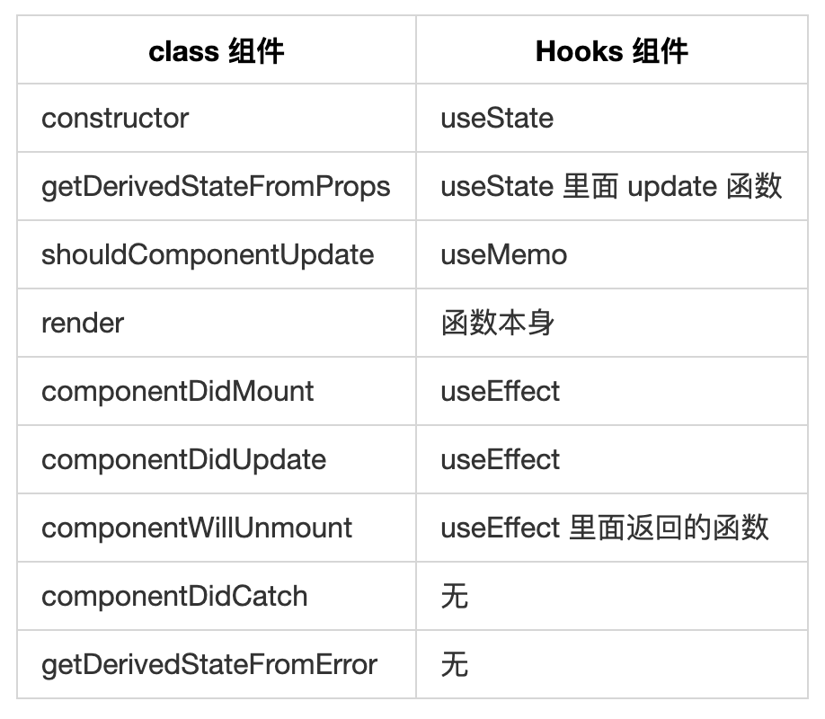

# Knowledge

## 1. react的实现原理？有什么优缺点？

## 2. react的控制组件和非控制组件

## 3. 说一下对 React Hook 的理解，它的实现原理，和生命周期有哪些区别？

### 一、React Hook

#### 1.1 什么是 React Hook

**Hook** 是 React 16.8 的新增特性。它可以让你在不编写 class 的情况下使用 state 以及其他的 React 特性。

Hook 增加了函数式组件中state的使用，在之前函数式组件是无法拥有自己的状态，只能通过props以及context来渲染自己的UI，而在业务逻辑中，有些场景必须要使用到state，那么我们就只能将函数式组件定义为class组件。而现在通过Hook，我们可以轻松的在函数式组件中维护我们的状态，不需要更改为class组件。

hooks 之前，React 存在很多问题

1. 在组件间复用状态逻辑很难

2. 复杂组件变得难以理解，高阶组件和函数组件的嵌套过深。

3. class 组件的 this 指向问题

4. 难以记忆的生命周期

hooks 很好的解决了上述问题，hooks 提供了很多方法

1. useState 返回有状态值，以及更新这个状态值的函数

2. useEffect 接受包含命令式，可能有副作用代码的函数。

3. useContext 接受上下文对象（从 React.createContext 返回的值）并返回当前上下文值，

4. useReducer useState 的替代方案。接受类型为(state，action) => newState 的 reducer，并返回与 dispatch 方法配对的当前状态。

5. useCallback 返回一个回忆的 memoized 版本，该版本仅在其中一个输入发生更改时才会更改。纯函数的输入输出确定性

6. useMemo 纯的一个记忆函数

7. useRef 返回一个可变的 ref 对象，其.current 属性被初始化为传递的参数

8. useImperativeMethods 自定义使用 ref 时公开给父组件的实例值

9. useMutationEffect 更新兄弟组件之前，它在 React 执行其 DOM 改变的同一阶段同步触发

10. useLayoutEffect DOM 改变后同步触发。使用它来从 DOM 读取布局并同步重新渲染

#### 1.2 React Hook 要解决什么问题

**React Hooks**要解决的问题是状态共享，这里的状态共享是指只共享状态逻辑复用，并不是指数据之间的共享。我们知道在React Hooks之前，解决状态逻辑复用问题，我们通常使用higher-order components和render-props。

既然已经有了这两种解决方案，为什么React开发者还要引入React Hook？对于higher-order components和render-props，React Hook的优势在哪？

> Hook 最大的优势其实还是对于状态逻辑的复用便捷，还有代码的简洁，以及帮助函数组件增强功能，

我们先来看一下React官方给出的React Hook的demo

```js
import { useState } from "React";

function Example() {
  // Declare a new state variable, which we'll call "count"
  const [count, setCount] = useState(0);

  return (
    <div>
      <p>You clicked {count} times</p>
      <button onClick={() => setCount(count + 1)}>Click me</button>
    </div>
  );
}
```

我们再来看看不用React Hook的话，如何实现

```js
class Example extends React.Component {
  constructor(props) {
    super(props);
    this.state = {
      count: 0,
    };
  }

  render() {
    return (
      <div>
        <p>You clicked {this.state.count} times</p>
        <button onClick={() => this.setState({ count: this.state.count + 1 })}>
          Click me
        </button>
      </div>
    );
  }
}
```

可以看到，在React Hook中，class Example组件变成了函数式组件，但是这个函数式组件却拥有的自己的状态，同时还可以更新自身的状态。这一切都得益于useState这个Hook，useState 会返回一对值：当前状态和一个让你更新它的函数，你可以在事件处理函数中或其他一些地方调用这个函数。它类似 class 组件的 this.setState，但是它不会把新的 state 和旧的 state 进行合并

#### 1.3 实现原理

Hooks 的基本类型：

```js
type Hooks = {
  memoizedState: any, // 指向当前渲染节点 Fiber
  baseState: any, // 初始化 initialState， 已经每次 dispatch 之后 newState
  baseUpdate: Update<any> | null, // 当前需要更新的 Update ，每次更新完之后，会赋值上一个 update，方便 react 在渲染错误的边缘，数据回溯
  queue: UpdateQueue<any> | null, // UpdateQueue 通过
  next: Hook | null, // link 到下一个 hooks，通过 next 串联每一 hooks
};

type Effect = {
  tag: HookEffectTag, // effectTag 标记当前 hook 作用在 life-cycles 的哪一个阶段
  create: () => mixed, // 初始化 callback
  destroy: (() => mixed) | null, // 卸载 callback
  deps: Array<mixed> | null,
  next: Effect, // 同上
};
```

React Hooks 全局维护了一个 workInProgressHook 变量，每一次调取 Hooks API 都会首先调取 createWorkInProgressHooks 函数。

```js
function createWorkInProgressHook() {
  if (workInProgressHook === null) {
    // This is the first hook in the list
    if (firstWorkInProgressHook === null) {
      currentHook = firstCurrentHook;
      if (currentHook === null) {
        // This is a newly mounted hook
        workInProgressHook = createHook();
      } else {
        // Clone the current hook.
        workInProgressHook = cloneHook(currentHook);
      }
      firstWorkInProgressHook = workInProgressHook;
    } else {
      // There's already a work-in-progress. Reuse it.
      currentHook = firstCurrentHook;
      workInProgressHook = firstWorkInProgressHook;
    }
  } else {
    if (workInProgressHook.next === null) {
      let hook;
      if (currentHook === null) {
        // This is a newly mounted hook
        hook = createHook();
      } else {
        currentHook = currentHook.next;
        if (currentHook === null) {
          // This is a newly mounted hook
          hook = createHook();
        } else {
          // Clone the current hook.
          hook = cloneHook(currentHook);
        }
      }
      // Append to the end of the list
      workInProgressHook = workInProgressHook.next = hook;
    } else {
      // There's already a work-in-progress. Reuse it.
      workInProgressHook = workInProgressHook.next;
      currentHook = currentHook !== null ? currentHook.next : null;
    }
  }
  return workInProgressHook;
}
```

### 二、和生命周期的区别

函数组件 的本质是函数，没有 state 的概念的，因此不存在生命周期一说，仅仅是一个 render 函数而已。

但是引入 Hooks 之后就变得不同了，它能让组件在不使用 class 的情况下拥有 state，所以就有了生命周期的概念，所谓的生命周期其实就是 useState、 useEffect() 和 useLayoutEffect() 。

即：Hooks 组件（使用了 Hooks 的函数组件）有生命周期，而函数组件（未使用 Hooks 的函数组件）是没有生命周期的。

下面，是具体的 class 与 Hooks 的生命周期对应关系：



##
##
##
##
##
##
##
##
##
##
##
##
##
##
##
##
##
##
##
##
##